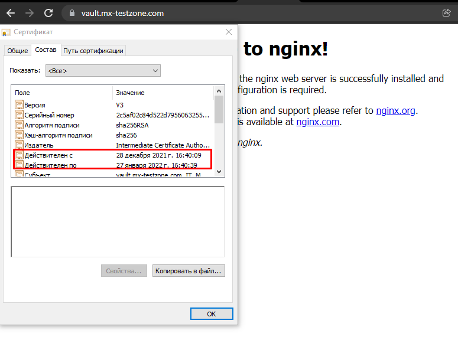
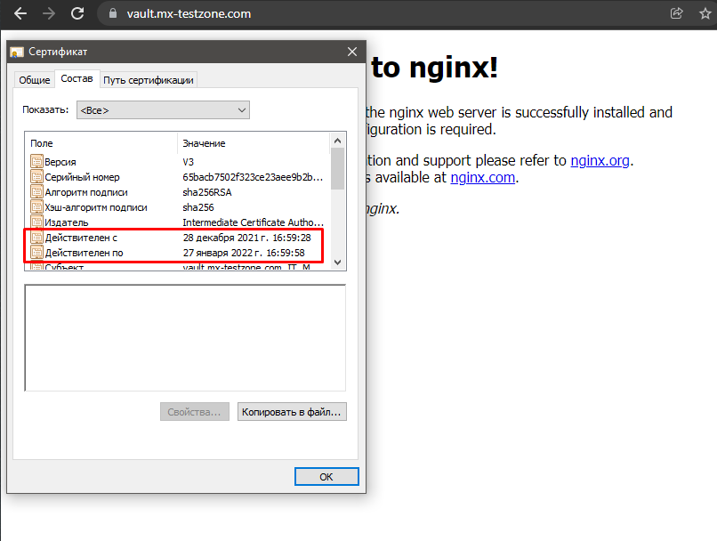
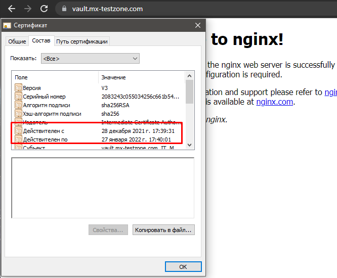

1. Установка и настройка ufw
```
sudo apt install ufw
sudo ufw default deny incoming
sudo ufw default allow outgoing
sudo ufw allow ssh
sudo ufw allow https
sudo ufw enable
```
В систем логе видно как боты ломятся на разные порты и ufw их блокирует.
```
Dec 28 16:54:51 netology kernel: [20059.063103] [UFW BLOCK] IN=eth0 OUT= MAC=00:15:5d:00:e5:b3:b4:14:89:00:46:40:08:00 SRC=5.135.0.34 DST=213.87.100.171 LEN=40 TOS=0x00 PREC=0x00 TTL=234 ID=39008 PROTO=TCP SPT=57738 DPT=11338 WINDOW=1024 RES=0x00 SYN URGP=0
Dec 28 16:55:00 netology kernel: [20068.389957] [UFW BLOCK] IN=eth0 OUT= MAC=00:15:5d:00:e5:b3:b4:14:89:00:46:40:08:00 SRC=213.87.97.88 DST=213.87.100.171 LEN=385 TOS=0x00 PREC=0x60 TTL=120 ID=0 PROTO=UDP SPT=5060 DPT=5060 LEN=365
Dec 28 16:55:20 netology kernel: [20088.411061] [UFW BLOCK] IN=eth0 OUT= MAC=00:15:5d:00:e5:b3:b4:14:89:00:46:40:08:00 SRC=213.87.97.88 DST=213.87.100.171 LEN=385 TOS=0x00 PREC=0x60 TTL=120 ID=0 PROTO=UDP SPT=5060 DPT=5060 LEN=365
Dec 28 16:55:45 netology kernel: [20113.227788] [UFW BLOCK] IN=eth0 OUT= MAC=00:15:5d:00:e5:b3:b4:14:89:00:46:40:08:00 SRC=89.248.165.97 DST=213.87.100.171 LEN=40 TOS=0x00 PREC=0x00 TTL=238 ID=12387 PROTO=TCP SPT=50866 DPT=44180 WINDOW=1024 RES=0x00 SYN URGP=0
Dec 28 16:56:05 netology kernel: [20133.176918] [UFW BLOCK] IN=eth0 OUT= MAC=00:15:5d:00:e5:b3:b4:14:89:00:46:40:08:00 SRC=71.6.199.23 DST=213.87.100.171 LEN=44 TOS=0x10 PREC=0x00 TTL=98 ID=5186 PROTO=TCP SPT=23320 DPT=9001 WINDOW=5841 RES=0x00 SYN URGP=0
Dec 28 16:56:21 netology kernel: [20148.848898] [UFW BLOCK] IN=eth0 OUT= MAC=00:15:5d:00:e5:b3:b4:14:89:00:46:40:08:00 SRC=2.56.56.189 DST=213.87.100.171 LEN=40 TOS=0x00 PREC=0x00 TTL=237 ID=52934 PROTO=TCP SPT=43239 DPT=14098 WINDOW=1024 RES=0x00 SYN URGP=0
Dec 28 16:56:41 netology kernel: [20168.912315] [UFW BLOCK] IN=eth0 OUT= MAC=00:15:5d:00:e5:b3:b4:14:89:00:46:40:08:00 SRC=45.146.165.108 DST=213.87.100.171 LEN=40 TOS=0x00 PREC=0x00 TTL=237 ID=5075 PROTO=TCP SPT=43142 DPT=4353 WINDOW=1024 RES=0x00 SYN URGP=0
Dec 28 16:57:11 netology kernel: [20199.517542] [UFW BLOCK] IN=eth0 OUT= MAC=00:15:5d:00:e5:b3:b4:14:89:00:46:40:08:00 SRC=139.59.244.75 DST=213.87.100.171 LEN=79 TOS=0x00 PREC=0x00 TTL=35 ID=31508 DF PROTO=UDP SPT=55128 DPT=1900 LEN=59
Dec 28 16:57:24 netology kernel: [20212.603876] [UFW BLOCK] IN=eth0 OUT= MAC=00:15:5d:00:e5:b3:b4:14:89:00:46:40:08:00 SRC=45.146.165.108 DST=213.87.100.171 LEN=40 TOS=0x00 PREC=0x00 TTL=236 ID=53380 PROTO=TCP SPT=43142 DPT=4780 WINDOW=1024 RES=0x00 SYN URGP=0
Dec 28 16:57:41 netology kernel: [20229.810704] [UFW BLOCK] IN=eth0 OUT= MAC=00:15:5d:00:e5:b3:b4:14:89:00:46:40:08:00 SRC=47.107.104.10 DST=213.87.100.171 LEN=40 TOS=0x00 PREC=0x00 TTL=230 ID=24393 PROTO=TCP SPT=54569 DPT=2375 WINDOW=1024 RES=0x00 SYN URGP=0
Dec 28 16:58:03 netology kernel: [20251.090876] [UFW BLOCK] IN=eth0 OUT= MAC=00:15:5d:00:e5:b3:b4:14:89:00:46:40:08:00 SRC=213.87.96.96 DST=213.87.100.171 LEN=40 TOS=0x00 PREC=0x00 TTL=246 ID=46214 DF PROTO=TCP SPT=34146 DPT=23 WINDOW=14600 RES=0x00 SYN URGP=0
Dec 28 16:58:24 netology kernel: [20272.614129] [UFW BLOCK] IN=eth0 OUT= MAC=00:15:5d:00:e5:b3:b4:14:89:00:46:40:08:00 SRC=47.107.104.10 DST=213.87.100.171 LEN=40 TOS=0x00 PREC=0x00 TTL=230 ID=64002 PROTO=TCP SPT=54569 DPT=2376 WINDOW=1024 RES=0x00 SYN URGP=0
Dec 28 16:58:42 netology kernel: [20290.484348] [UFW BLOCK] IN=eth0 OUT= MAC=00:15:5d:00:e5:b3:b4:14:89:00:46:40:08:00 SRC=89.248.168.220 DST=213.87.100.171 LEN=40 TOS=0x00 PREC=0x00 TTL=239 ID=54321 PROTO=TCP SPT=48478 DPT=20443 WINDOW=65535 RES=0x00 SYN URGP=0
Dec 28 16:59:00 netology kernel: [20308.397120] [UFW BLOCK] IN=eth0 OUT= MAC=00:15:5d:00:e5:b3:b4:14:89:00:46:40:08:00 SRC=213.87.97.88 DST=213.87.100.171 LEN=384 TOS=0x00 PREC=0x60 TTL=120 ID=0 PROTO=UDP SPT=5060 DPT=5060 LEN=364
Dec 28 16:59:20 netology kernel: [20328.405337] [UFW BLOCK] IN=eth0 OUT= MAC=00:15:5d:00:e5:b3:b4:14:89:00:46:40:08:00 SRC=213.87.97.88 DST=213.87.100.171 LEN=384 TOS=0x00 PREC=0x60 TTL=120 ID=0 PROTO=UDP SPT=5060 DPT=5060 LEN=364
Dec 28 16:59:53 netology kernel: [20361.425223] [UFW BLOCK] IN=eth0 OUT= MAC=00:15:5d:00:e5:b3:b4:14:89:00:46:40:08:00 SRC=2.56.56.189 DST=213.87.100.171 LEN=40 TOS=0x00 PREC=0x00 TTL=237 ID=49106 PROTO=TCP SPT=43239 DPT=11816 WINDOW=1024 RES=0x00 SYN URGP=0
```


2. Для выпуска сертификата с помощью vault использовал след. скрипт:
```bash
#!/bin/bash


export VAULT_ADDR=http://127.0.0.1:8200 #путь дефолтный так как в дев режиме работает склеп
export VAULT_TOKEN=root 				#токен толже дефолтный для дев режима, на боевом все заменить!

ca_street="Vladivstok"
ca_org="MX"
ca_ou="IT"
ca_url="https://vault.mx-testzone.com"

# enable Vault PKI secret
vault secrets enable \
  -path=pki_root_ca \
  -description="PKI Root CA" \
  -max-lease-ttl="262800h" \
  pki

# generate root CA
vault write -format=json pki_root_ca/root/generate/internal \
  common_name="Root Certificate Authority" \
  country="Russian Federation" \
  locality="Vladivostok" \
  street_address="$ca_street" \
  postal_code="101000" \
  organization="$ca_org" \
  ou="$ca_ou" \
  ttl="262800h" > pki-root-ca.json

# save the certificate
cat pki-root-ca.json | jq -r .data.certificate > rootCA.pem

# publish urls for the root ca
vault write pki_root_ca/config/urls \
  issuing_certificates="$ca_url/v1/pki_root_ca/ca" \
  crl_distribution_points="$ca_url/v1/pki_root_ca/crl"

# enable Vault PKI secret
vault secrets enable \
  -path=pki_int_ca \
  -description="PKI Intermediate CA" \
  -max-lease-ttl="175200h" \
  pki

# create intermediate CA with common name mx-testzone.com and save the CSR
vault write -format=json pki_int_ca/intermediate/generate/internal \
  common_name="Intermediate Certificate Authority" \
  country="Russian Federation" \
  locality="Vladivostok" \
  street_address="$ca_street" \
  postal_code="101000" \
  organization="$ca_org" \
  ou="$ca_ou" \
  ttl="175200h" | jq -r '.data.csr' > pki_intermediate_ca.csr

# send the intermediate CA's CSR to the root CA
vault write -format=json pki_root_ca/root/sign-intermediate csr=@pki_intermediate_ca.csr \
  country="Russia Federation" \
  locality="Vladivostok" \
  street_address="$ca_street" \
  postal_code="101000" \
  organization="$ca_org" \
  ou="$ca_ou" \
  format=pem_bundle \
  ttl="175200h" | jq -r '.data.certificate' > intermediateCA.cert.pem

# publish the signed certificate back to the Intermediate CA
vault write pki_int_ca/intermediate/set-signed \
  certificate=@intermediateCA.cert.pem

# publish the intermediate CA urls ???
vault write pki_int_ca/config/urls \
  issuing_certificates="$ca_url/v1/pki_int_ca/ca" \
  crl_distribution_points="$ca_url/v1/pki_int_ca/crl"

# create a role mx-testzone-dot-com-server
vault write pki_int_ca/roles/mx-testzone-dot-com-server \
  country="Russia Federation" \
  locality="Vladivostok" \
  street_address="$ca_street" \
  postal_code="101000" \
  organization="$ca_org" \
  ou="$ca_ou" \
  allowed_domains="mx-testzone.com" \
  allow_subdomains=true \
  max_ttl="87600h" \
  key_bits="2048" \
  key_type="rsa" \
  allow_any_name=false \
  allow_bare_domains=false \
  allow_glob_domain=false \
  allow_ip_sans=true \
  allow_localhost=false \
  client_flag=false \
  server_flag=true \
  enforce_hostnames=true \
  key_usage="DigitalSignature,KeyEncipherment" \
  ext_key_usage="ServerAuth" \
  require_cn=true

# create a role mx-testzone-dot-com-client
vault write pki_int_ca/roles/mx-testzone-dot-com-client \
  country="Russia Federation" \
  locality="Vladivostok" \
  street_address="$ca_street" \
  postal_code="101000" \
  organization="$ca_org" \
  ou="$ca_ou" \
  allow_subdomains=true \
  max_ttl="87600h" \
  key_bits="2048" \
  key_type="rsa" \
  allow_any_name=true \
  allow_bare_domains=false \
  allow_glob_domain=false \
  allow_ip_sans=false \
  allow_localhost=false \
  client_flag=true \
  server_flag=false \
  enforce_hostnames=false \
  key_usage="DigitalSignature" \
  ext_key_usage="ClientAuth" \
  require_cn=true

# Create cert, 720 h
vault write -format=json pki_int_ca/issue/mx-testzone-dot-com-server \
  common_name="vault.mx-testzone.com" \
  alt_names="vault.mx-testzone.com" \
  ttl="720h" > vault.mx-testzone.com.crt

# save cert
cat vault.mx-testzone.com.crt | jq -r .data.certificate > vault.mx-testzone.com.crt.pem
cat vault.mx-testzone.com.crt | jq -r .data.issuing_ca >> vault.mx-testzone.com.crt.pem
cat vault.mx-testzone.com.crt | jq -r .data.private_key > vault.mx-testzone.com.crt.key
```
На выходе получаем готовый доверенный корневой сертификат, плюс цепочка сертификатов для nginx и ключ.
Доверенный импортируем на хостовой системе.

3. Устанавливаем настраиваем nginx

```
sudo apt install nginx


Конфиг отвечающий за настройку 


server {
    listen              443 ssl;
    server_name         vault.mx-testzone.com;
    ssl_certificate     /etc/nginx/ssl/vault.mx-testzone.com.crt.pem;
    ssl_certificate_key /etc/nginx/ssl/vault.mx-testzone.com.crt.key;
    ssl_protocols       TLSv1 TLSv1.1 TLSv1.2;
    ssl_ciphers         HIGH:!aNULL:!MD5;
    }

```
Подкладываем ключи в nginx и проверяем, все работает. 


4. Далее запускаем второй скрипт, который генерит новый сертификат и подкладывает в nginx и рестартует его.
```bash
#! /bin/bash

export VAULT_TOKEN=root
export VAULT_ADDR=http://127.0.0.1:8200

# Create cert, 1 month
vault write -format=json pki_int_ca/issue/mx-testzone-dot-com-server common_name="vault.mx-testzone.com" alt_names="vault.mx-testzone.com" ttl="720h" > vault.mx-testzone.com.crt

# save cert
cat vault.mx-testzone.com.crt | jq -r .data.certificate > vault.mx-testzone.com.crt.pem
cat vault.mx-testzone.com.crt | jq -r .data.issuing_ca >> vault.mx-testzone.com.crt.pem
cat vault.mx-testzone.com.crt | jq -r .data.private_key > vault.mx-testzone.com.crt.key

cp vault.mx-testzone.com.crt.* /etc/nginx/ssl/


/etc/init.d/nginx reload
```



5. Заворачиваем скрипт в crontab, ставим для примера 17 часов 40 минут каждый день. Должны получить такой сертификат в браузере.

``` 
crontab -e -uroot
40 17 * * * bash /etc/nginx/scripts/create_cert.sh >> /var/log/crontablog 2>&1
```
Видим в логе что крон выполнился.

Dec 28 17:40:01 netology CRON[4418]: (root) CMD (bash /etc/nginx/scripts/create_cert.sh >> /var/log/crontablog 2>&1)

Проверяем сертификат на сервере.



