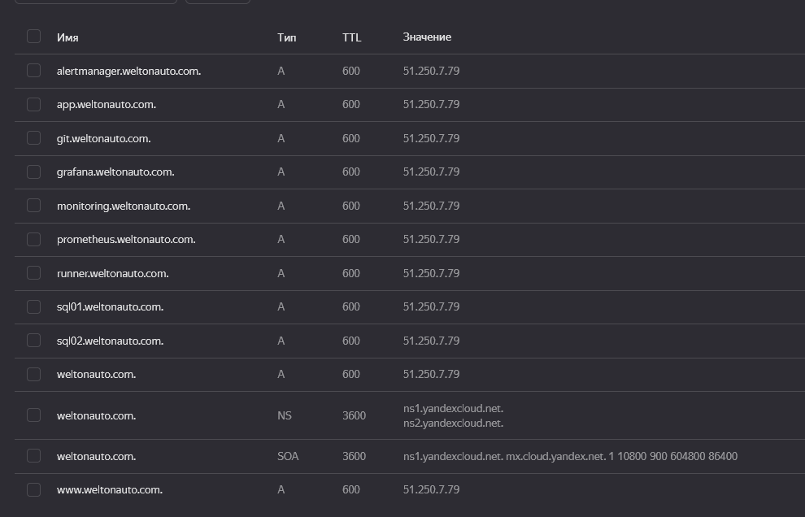
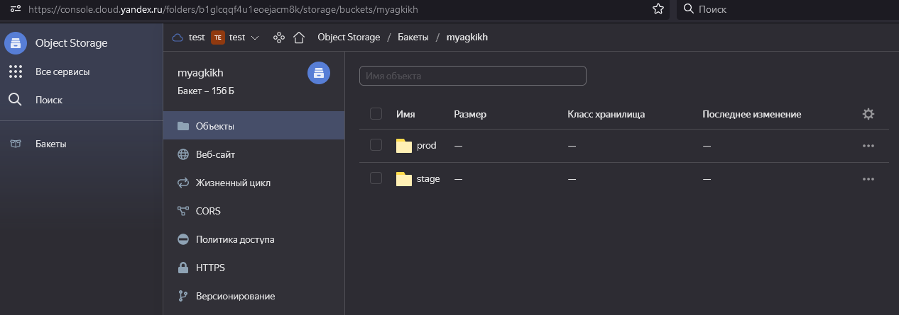
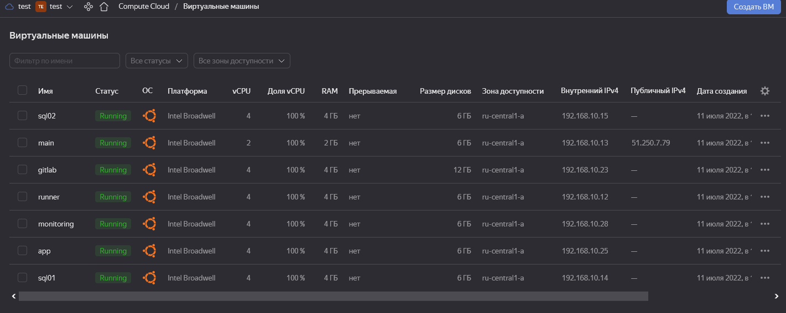

Дипломный практикум в YandexCloud

Цели:

 

1. Зарегистрирован домен на nic.ru.


В YandexCloud арендован статический адрес для проекта, в теории можно конечно заморочится и при запуске основного сервера, брать динамический адрес и прописывать его в зону автоматически, но время добавления в маршрутизацию зоны и кеш DNS серверов мешает оперативно тестировать изменения при таком раскладе.
Подобный проект реализован мною и выложен в доступ для создания сервера балансировки отказоустойчивого DNS с проверкой доступности хостов.
https://github.com/GMSolaris/yc-dns


Создана зона в yc DNS. В нее прописаны все нужные нам для работы хосты, все они ведут на основной сервер, который будет выступать у нас и прокси для доступа к внутренним ресурсам, так и прокси для доступа с машин внутри сети в интернет.


2. Заводим S3 бакет и в нем два workspace для наших экспериментов. 

В дальнейшем все данные terraform будут сохранятся в папку prod.


Подготавливаем terraform, устанавливаем провайдера yandex-cloud, проводим init.
```
myagkikh@netology:~/devops_dip/tf$ terraform init

Initializing the backend...

Initializing provider plugins...
- Reusing previous version of yandex-cloud/yandex from the dependency lock file
- Using previously-installed yandex-cloud/yandex v0.76.0

Terraform has been successfully initialized!

You may now begin working with Terraform. Try running "terraform plan" to see
any changes that are required for your infrastructure. All Terraform commands
should now work.

If you ever set or change modules or backend configuration for Terraform,
rerun this command to reinitialize your working directory. If you forget, other
commands will detect it and remind you to do so if necessary.
```

Далее запускаем создание инфраструктуры. Поднимаются все виртуальные машины, поднимается две подсети (subnet_100 дальше в проекте не используется, просто для демонстрации возможности автоматического развертывания сетей в разных зонах). 
```
yandex_vpc_network.network-1: Creating...
yandex_vpc_network.network-1: Creation complete after 3s [id=enp2qm0d3nn7tak06jq7]
yandex_vpc_subnet.subnet-1: Creating...
yandex_vpc_subnet.subnet_100: Creating...
yandex_vpc_subnet.subnet-1: Creation complete after 1s [id=e9brh8suftpukkhhbr8a]
yandex_compute_instance.master: Creating...
yandex_compute_instance.app: Creating...
yandex_compute_instance.monitoring: Creating...
yandex_compute_instance.runner: Creating...
yandex_compute_instance.slave: Creating...
yandex_compute_instance.main_server: Creating...
yandex_compute_instance.gitlab: Creating...
yandex_vpc_subnet.subnet_100: Creation complete after 2s [id=b0c2ic02jmh8mpndlsv4]
yandex_compute_instance.app: Still creating... [10s elapsed]
yandex_compute_instance.master: Still creating... [10s elapsed]
yandex_compute_instance.monitoring: Still creating... [10s elapsed]
yandex_compute_instance.runner: Still creating... [10s elapsed]
yandex_compute_instance.slave: Still creating... [10s elapsed]
yandex_compute_instance.main_server: Still creating... [10s elapsed]
yandex_compute_instance.gitlab: Still creating... [10s elapsed]
yandex_compute_instance.app: Still creating... [20s elapsed]
yandex_compute_instance.master: Still creating... [20s elapsed]
yandex_compute_instance.monitoring: Still creating... [20s elapsed]
yandex_compute_instance.slave: Still creating... [20s elapsed]
yandex_compute_instance.runner: Still creating... [20s elapsed]
yandex_compute_instance.main_server: Still creating... [20s elapsed]
yandex_compute_instance.gitlab: Still creating... [20s elapsed]
yandex_compute_instance.slave: Creation complete after 23s [id=fhm28r2bog2fbndkps8g]
yandex_compute_instance.gitlab: Creation complete after 24s [id=fhm7puuf548gfm8sqeo6]
yandex_compute_instance.app: Creation complete after 24s [id=fhmidv06phvfeu2a9df9]
yandex_compute_instance.runner: Creation complete after 24s [id=fhm9i8keksb3nukh1sp0]
yandex_compute_instance.main_server: Creation complete after 24s [id=fhm5rsd0s1fcrce45gb1]
yandex_compute_instance.monitoring: Creation complete after 25s [id=fhmgvfk54kn52vipo6vs]
yandex_compute_instance.master: Creation complete after 25s [id=fhmkmcd4gf44vq55iqui]

Apply complete! Resources: 10 added, 0 changed, 0 destroyed.
```
В консоли YandexCloud видно появившиеся виртуальны машины.


Разбираем все обратно, для этапа тестирования terraform важно не забывать удалять ресурсы, чтобы не сжигать баланс.
```
yandex_compute_instance.runner: Destroying... [id=fhm9i8keksb3nukh1sp0]
yandex_compute_instance.main_server: Destroying... [id=fhm5rsd0s1fcrce45gb1]
yandex_compute_instance.monitoring: Destroying... [id=fhmgvfk54kn52vipo6vs]
yandex_vpc_subnet.subnet_100: Destroying... [id=b0c2ic02jmh8mpndlsv4]
yandex_compute_instance.master: Destroying... [id=fhmkmcd4gf44vq55iqui]
yandex_compute_instance.app: Destroying... [id=fhmidv06phvfeu2a9df9]
yandex_compute_instance.gitlab: Destroying... [id=fhm7puuf548gfm8sqeo6]
yandex_compute_instance.slave: Destroying... [id=fhm28r2bog2fbndkps8g]
yandex_compute_instance.runner: Still destroying... [id=fhm9i8keksb3nukh1sp0, 10s elapsed]
yandex_compute_instance.main_server: Still destroying... [id=fhm5rsd0s1fcrce45gb1, 10s elapsed]
yandex_vpc_subnet.subnet_100: Still destroying... [id=b0c2ic02jmh8mpndlsv4, 10s elapsed]
yandex_compute_instance.monitoring: Still destroying... [id=fhmgvfk54kn52vipo6vs, 10s elapsed]
yandex_compute_instance.master: Still destroying... [id=fhmkmcd4gf44vq55iqui, 10s elapsed]
yandex_compute_instance.gitlab: Still destroying... [id=fhm7puuf548gfm8sqeo6, 10s elapsed]
yandex_compute_instance.slave: Still destroying... [id=fhm28r2bog2fbndkps8g, 10s elapsed]
yandex_compute_instance.app: Still destroying... [id=fhmidv06phvfeu2a9df9, 10s elapsed]
yandex_vpc_subnet.subnet_100: Destruction complete after 11s
yandex_compute_instance.app: Destruction complete after 18s
yandex_compute_instance.slave: Destruction complete after 18s
yandex_compute_instance.monitoring: Destruction complete after 19s
yandex_compute_instance.master: Destruction complete after 19s
yandex_compute_instance.gitlab: Destruction complete after 19s
yandex_compute_instance.runner: Destruction complete after 19s
yandex_compute_instance.main_server: Still destroying... [id=fhm5rsd0s1fcrce45gb1, 20s elapsed]
yandex_compute_instance.main_server: Destruction complete after 22s
yandex_vpc_subnet.subnet-1: Destroying... [id=e9brh8suftpukkhhbr8a]
yandex_vpc_subnet.subnet-1: Destruction complete after 8s
yandex_vpc_network.network-1: Destroying... [id=enp2qm0d3nn7tak06jq7]
yandex_vpc_network.network-1: Destruction complete after 1s

Destroy complete! Resources: 10 destroyed.
```

Описание файлов используемых для разворачивания инфраструктуры:
- providers.tf Описание провайдеров используемых в работе, yandex, s3, авторизационные ключи доступа
- network.tf Описание сетей используемых в проекте
- variables.tf Переменные используемые в проекте
- main.tf Описание виртуальной машины используемой для основной развертки всего проекта
- mysql.tf Описание виртуальных машин используемых для создание кластера mysql (master->slave)
- app Описание виртуальной машины для сервера приложений (в текущем проекте это будет Wordpress)
- gitlab.tf Описание виртуальной машины для сервера gitlab
- runner Описание виртуальной машины для сервера gitlab-runner 
- monitoring.tf Описание виртуальной машины для сервера мониторинга (Prometheus, Grafana, Alretmanager)
- meta.txt Данные для доступа на виртуальные машины, которые пробрасываются при создании на каждую.

3. 