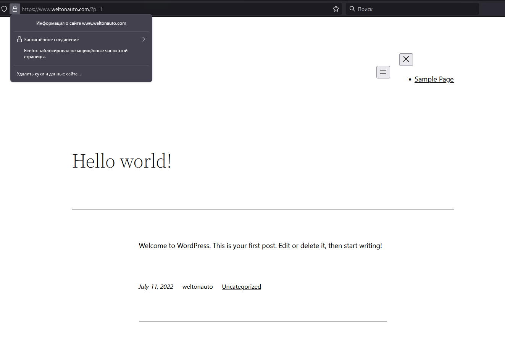

Дипломный практикум в YandexCloud

1. Зарегистрирован домен на nic.ru.


В YandexCloud арендован статический адрес для проекта, в теории можно конечно заморочится и при запуске основного сервера, брать динамический адрес и прописывать его в зону автоматически, но время добавления в маршрутизацию зоны и кеш DNS серверов мешает оперативно тестировать изменения при таком раскладе.
Подобный проект реализован мною и выложен в доступ для создания сервера балансировки отказоустойчивого DNS с проверкой доступности хостов.
https://github.com/GMSolaris/yc-dns


Создана зона в yc DNS. В нее прописаны все нужные нам для работы хосты, все они ведут на основной сервер, который будет выступать у нас как и прокси для доступа к внутренним ресурсам, так и прокси для доступа с машин внутри сети в интернет.


2. Заводим S3 бакет и в нем два workspace для наших экспериментов. 


В дальнейшем все данные terraform будут сохранятся в папку prod.


Подготавливаем terraform, устанавливаем провайдера yandex-cloud, проводим init.
```
myagkikh@netology:~/devops_dip/tf$ terraform init

Initializing the backend...

Initializing provider plugins...
- Reusing previous version of yandex-cloud/yandex from the dependency lock file
- Using previously-installed yandex-cloud/yandex v0.76.0

Terraform has been successfully initialized!

You may now begin working with Terraform. Try running "terraform plan" to see
any changes that are required for your infrastructure. All Terraform commands
should now work.

If you ever set or change modules or backend configuration for Terraform,
rerun this command to reinitialize your working directory. If you forget, other
commands will detect it and remind you to do so if necessary.
```

Далее запускаем создание инфраструктуры. Поднимаются все виртуальные машины, поднимается две подсети (subnet_100 дальше в проекте не используется, просто для демонстрации возможности автоматического развертывания сетей в разных зонах). 
```
yandex_vpc_network.network-1: Creating...
yandex_vpc_network.network-1: Creation complete after 3s [id=enp2qm0d3nn7tak06jq7]
yandex_vpc_subnet.subnet-1: Creating...
yandex_vpc_subnet.subnet_100: Creating...
yandex_vpc_subnet.subnet-1: Creation complete after 1s [id=e9brh8suftpukkhhbr8a]
yandex_compute_instance.master: Creating...
yandex_compute_instance.app: Creating...
yandex_compute_instance.monitoring: Creating...
yandex_compute_instance.runner: Creating...
yandex_compute_instance.slave: Creating...
yandex_compute_instance.main_server: Creating...
yandex_compute_instance.gitlab: Creating...
yandex_vpc_subnet.subnet_100: Creation complete after 2s [id=b0c2ic02jmh8mpndlsv4]
yandex_compute_instance.app: Still creating... [10s elapsed]
yandex_compute_instance.master: Still creating... [10s elapsed]
yandex_compute_instance.monitoring: Still creating... [10s elapsed]
yandex_compute_instance.runner: Still creating... [10s elapsed]
yandex_compute_instance.slave: Still creating... [10s elapsed]
yandex_compute_instance.main_server: Still creating... [10s elapsed]
yandex_compute_instance.gitlab: Still creating... [10s elapsed]
yandex_compute_instance.app: Still creating... [20s elapsed]
yandex_compute_instance.master: Still creating... [20s elapsed]
yandex_compute_instance.monitoring: Still creating... [20s elapsed]
yandex_compute_instance.slave: Still creating... [20s elapsed]
yandex_compute_instance.runner: Still creating... [20s elapsed]
yandex_compute_instance.main_server: Still creating... [20s elapsed]
yandex_compute_instance.gitlab: Still creating... [20s elapsed]
yandex_compute_instance.slave: Creation complete after 23s [id=fhm28r2bog2fbndkps8g]
yandex_compute_instance.gitlab: Creation complete after 24s [id=fhm7puuf548gfm8sqeo6]
yandex_compute_instance.app: Creation complete after 24s [id=fhmidv06phvfeu2a9df9]
yandex_compute_instance.runner: Creation complete after 24s [id=fhm9i8keksb3nukh1sp0]
yandex_compute_instance.main_server: Creation complete after 24s [id=fhm5rsd0s1fcrce45gb1]
yandex_compute_instance.monitoring: Creation complete after 25s [id=fhmgvfk54kn52vipo6vs]
yandex_compute_instance.master: Creation complete after 25s [id=fhmkmcd4gf44vq55iqui]

Apply complete! Resources: 10 added, 0 changed, 0 destroyed.
```
В консоли YandexCloud видно появившиеся виртуальны машины.


Разбираем все обратно, для этапа тестирования terraform важно не забывать удалять ресурсы, чтобы не сжигать баланс.
```
yandex_compute_instance.runner: Destroying... [id=fhm9i8keksb3nukh1sp0]
yandex_compute_instance.main_server: Destroying... [id=fhm5rsd0s1fcrce45gb1]
yandex_compute_instance.monitoring: Destroying... [id=fhmgvfk54kn52vipo6vs]
yandex_vpc_subnet.subnet_100: Destroying... [id=b0c2ic02jmh8mpndlsv4]
yandex_compute_instance.master: Destroying... [id=fhmkmcd4gf44vq55iqui]
yandex_compute_instance.app: Destroying... [id=fhmidv06phvfeu2a9df9]
yandex_compute_instance.gitlab: Destroying... [id=fhm7puuf548gfm8sqeo6]
yandex_compute_instance.slave: Destroying... [id=fhm28r2bog2fbndkps8g]
yandex_compute_instance.runner: Still destroying... [id=fhm9i8keksb3nukh1sp0, 10s elapsed]
yandex_compute_instance.main_server: Still destroying... [id=fhm5rsd0s1fcrce45gb1, 10s elapsed]
yandex_vpc_subnet.subnet_100: Still destroying... [id=b0c2ic02jmh8mpndlsv4, 10s elapsed]
yandex_compute_instance.monitoring: Still destroying... [id=fhmgvfk54kn52vipo6vs, 10s elapsed]
yandex_compute_instance.master: Still destroying... [id=fhmkmcd4gf44vq55iqui, 10s elapsed]
yandex_compute_instance.gitlab: Still destroying... [id=fhm7puuf548gfm8sqeo6, 10s elapsed]
yandex_compute_instance.slave: Still destroying... [id=fhm28r2bog2fbndkps8g, 10s elapsed]
yandex_compute_instance.app: Still destroying... [id=fhmidv06phvfeu2a9df9, 10s elapsed]
yandex_vpc_subnet.subnet_100: Destruction complete after 11s
yandex_compute_instance.app: Destruction complete after 18s
yandex_compute_instance.slave: Destruction complete after 18s
yandex_compute_instance.monitoring: Destruction complete after 19s
yandex_compute_instance.master: Destruction complete after 19s
yandex_compute_instance.gitlab: Destruction complete after 19s
yandex_compute_instance.runner: Destruction complete after 19s
yandex_compute_instance.main_server: Still destroying... [id=fhm5rsd0s1fcrce45gb1, 20s elapsed]
yandex_compute_instance.main_server: Destruction complete after 22s
yandex_vpc_subnet.subnet-1: Destroying... [id=e9brh8suftpukkhhbr8a]
yandex_vpc_subnet.subnet-1: Destruction complete after 8s
yandex_vpc_network.network-1: Destroying... [id=enp2qm0d3nn7tak06jq7]
yandex_vpc_network.network-1: Destruction complete after 1s

Destroy complete! Resources: 10 destroyed.
```

Описание файлов используемых для разворачивания инфраструктуры:
- providers.tf Описание провайдеров используемых в работе, yandex, s3, авторизационные ключи доступа
- network.tf Описание сетей используемых в проекте
- variables.tf Переменные используемые в проекте
- main.tf Описание виртуальной машины используемой для основной развертки всего проекта
- mysql.tf Описание виртуальных машин используемых для создание кластера mysql (master->slave)
- app.tf Описание виртуальной машины для сервера приложений (в текущем проекте это будет Wordpress)
- gitlab.tf Описание виртуальной машины для сервера gitlab
- runner.tf Описание виртуальной машины для сервера gitlab-runner 
- monitoring.tf Описание виртуальной машины для сервера мониторинга (Prometheus, Grafana, Alretmanager)
- meta.txt Данные для доступа на виртуальные машины, которые пробрасываются при создании на каждую.

3. Для выполнения этого этапа необходимо запустить плейбук anisble/main.yml, который содержит две роли. Первая устанавливает nginx, проводит его настройку, далее устаналивает LetsEncrypt и активирует сертификаты. Так же специально в этом проекте решил попробовать использовать nginx как ssh прокси для доступа к машинам внутри сети. Можно было бы использовать ssh tunnel или jump server. Но было интересно именно организовать доступ к ресурсам внутри сети по протоколу tcp используя nginx в сочетании с модулем stream. Для этого в конфиг nginx добавлено:
load_module /usr/lib/nginx/modules/ngx_stream_module.so;
Конфиг проброса порта выглядит так
```
stream {
    server {
        listen 2201;
        proxy_connect_timeout 600s;
        proxy_timeout 600s;
        proxy_pass sql01.weltonauto.com:22;
    }
```
После установки nginx запустится вторая роль, она устанавливает простенький proxy и разрешает использовать его изнутри локальной сети, для доступа машин в интернет. 

<details><summary>Вывод ansible-playbook</summary>

```
myagkikh@netology:~/devops_dip/tf$ ansible-playbook ../ansible/main.yml -i ../ansible/hosts

PLAY [main] *******************************************************************

TASK [Gathering Facts] ********************************************************
ok: [weltonauto.com]

TASK [install_nginx : Upgrade system] *****************************************
changed: [weltonauto.com]

TASK [install_nginx : Install nginx] ******************************************
changed: [weltonauto.com]

TASK [install_nginx : install letsencrypt] ************************************
changed: [weltonauto.com]

TASK [install_nginx : create letsencrypt directory] ***************************
changed: [weltonauto.com]

TASK [install_nginx : Remove default nginx config] ****************************
changed: [weltonauto.com]

TASK [install_nginx : Install system nginx default config] ********************
changed: [weltonauto.com]

TASK [install_nginx : Install letsencrypt config] *****************************
changed: [weltonauto.com]

TASK [install_nginx : Reload nginx to activate letsencrypt site] **************
changed: [weltonauto.com]

TASK [install_nginx : Create letsencrypt certificate main] ********************
changed: [weltonauto.com]

TASK [install_nginx : Create letsencrypt certificate gitlab] ******************
changed: [weltonauto.com]

TASK [install_nginx : Create letsencrypt certificate grafana] *****************
changed: [weltonauto.com]

TASK [install_nginx : Create letsencrypt certificate prometheus] **************
changed: [weltonauto.com]

TASK [install_nginx : Create letsencrypt certificate alertmanager] ************
changed: [weltonauto.com]

TASK [install_nginx : Generate dhparams] **************************************
changed: [weltonauto.com]

TASK [install_nginx : Install nginx site for specified site] ******************
changed: [weltonauto.com]

TASK [install_nginx : Reload nginx to activate specified site] ****************
changed: [weltonauto.com]

TASK [install_nginx : Add letsencrypt cronjob for cert renewal] ***************
changed: [weltonauto.com]

TASK [install_proxy : install privoxy] ****************************************
changed: [weltonauto.com]

TASK [install_proxy : configure privoxy] **************************************
changed: [weltonauto.com]

TASK [install_proxy : start privoxy] ******************************************
ok: [weltonauto.com]

RUNNING HANDLER [install_proxy : restart privoxy] *****************************
changed: [weltonauto.com]

PLAY RECAP ********************************************************************
weltonauto.com             : ok=22   changed=20   unreachable=0    failed=0    skipped=0    rescued=0    ignored=0

```
</details>

После этого пробуем зайти на любой сервер и получить 502, так как он еще не настроен. 


Так же обращаем внимание, что сертификат у нас не валидный, так как в режиме разработки проекта мы использовали --staging режим создания сертификатов. В дальнейшей работе после всех отладок мы будем использовать уже рабочий режим создания сертификатов. Для этого в роли мы уберем соотвествующий параметр.


4. Для установки кластера mysql используем плейбук ansible/mysql.yml. Он устанавливает на две наших виртуальных машины mysql сервера и собирает кластер master->slave. Так же добавляется пустая база wordpress для нашего проекта Wordpress, добавляется пользователь wordpress \ wordpress с полными правами на базу.


<details><summary>Вывод ansible-playbook</summary>

```
myagkikh@netology:~/devops_dip/tf$ ansible-playbook ../ansible/mysql.yml -i ../ansible/hosts

PLAY [mysql] ******************************************************************************

TASK [Gathering Facts] ********************************************************************
ok: [sql01.weltonauto.com]
ok: [sql02.weltonauto.com]

TASK [install_mysql : include_tasks] ******************************************************
included: /home/myagkikh/devops_dip/ansible/roles/install_mysql/tasks/variables.yml for sql01.weltonauto.com, sql02.weltonauto.com

TASK [install_mysql : Include OS-specific variables.] *************************************
ok: [sql01.weltonauto.com] => (item=/home/myagkikh/devops_dip/ansible/roles/install_mysql/vars/Debian.yml)
ok: [sql02.weltonauto.com] => (item=/home/myagkikh/devops_dip/ansible/roles/install_mysql/vars/Debian.yml)

TASK [install_mysql : Define mysql_packages.] *********************************************
ok: [sql01.weltonauto.com]
ok: [sql02.weltonauto.com]

TASK [install_mysql : Define mysql_daemon.] ***********************************************
ok: [sql01.weltonauto.com]
ok: [sql02.weltonauto.com]

TASK [install_mysql : Define mysql_slow_query_log_file.] **********************************
ok: [sql01.weltonauto.com]
ok: [sql02.weltonauto.com]

TASK [install_mysql : Define mysql_log_error.] ********************************************
ok: [sql01.weltonauto.com]
ok: [sql02.weltonauto.com]

TASK [install_mysql : Define mysql_syslog_tag.] *******************************************
ok: [sql01.weltonauto.com]
ok: [sql02.weltonauto.com]

TASK [install_mysql : Define mysql_pid_file.] *********************************************
ok: [sql01.weltonauto.com]
ok: [sql02.weltonauto.com]

TASK [install_mysql : Define mysql_config_file.] ******************************************
ok: [sql01.weltonauto.com]
ok: [sql02.weltonauto.com]

TASK [install_mysql : Define mysql_config_include_dir.] ***********************************
ok: [sql01.weltonauto.com]
ok: [sql02.weltonauto.com]

TASK [install_mysql : Define mysql_socket.] ***********************************************
ok: [sql01.weltonauto.com]
ok: [sql02.weltonauto.com]

TASK [install_mysql : Define mysql_supports_innodb_large_prefix.] *************************
ok: [sql01.weltonauto.com]
ok: [sql02.weltonauto.com]

TASK [install_mysql : include_tasks] ******************************************************
skipping: [sql01.weltonauto.com]
skipping: [sql02.weltonauto.com]

TASK [install_mysql : include_tasks] ******************************************************
included: /home/myagkikh/devops_dip/ansible/roles/install_mysql/tasks/setup-Debian.yml for sql01.weltonauto.com, sql02.weltonauto.com

TASK [install_mysql : Check if MySQL is already installed.] *******************************
ok: [sql01.weltonauto.com]
ok: [sql02.weltonauto.com]

TASK [install_mysql : Update apt cache if MySQL is not yet installed.] ********************
ok: [sql01.weltonauto.com]
ok: [sql02.weltonauto.com]

TASK [install_mysql : Ensure MySQL Python libraries are installed.] ***********************
changed: [sql01.weltonauto.com]
changed: [sql02.weltonauto.com]

TASK [install_mysql : Ensure MySQL packages are installed.] *******************************
changed: [sql02.weltonauto.com]
changed: [sql01.weltonauto.com]

TASK [install_mysql : Ensure MySQL is stopped after initial install.] *********************
changed: [sql01.weltonauto.com]
changed: [sql02.weltonauto.com]

TASK [install_mysql : Delete innodb log files created by apt package after initial install.] 
changed: [sql01.weltonauto.com] => (item=ib_logfile0)
changed: [sql02.weltonauto.com] => (item=ib_logfile0)
changed: [sql01.weltonauto.com] => (item=ib_logfile1)
changed: [sql02.weltonauto.com] => (item=ib_logfile1)

TASK [install_mysql : include_tasks] ******************************************************
skipping: [sql01.weltonauto.com]
skipping: [sql02.weltonauto.com]

TASK [install_mysql : Check if MySQL packages were installed.] ****************************
ok: [sql01.weltonauto.com]
ok: [sql02.weltonauto.com]

TASK [install_mysql : include_tasks] ******************************************************
included: /home/myagkikh/devops_dip/ansible/roles/install_mysql/tasks/configure.yml for sql01.weltonauto.com, sql02.weltonauto.com

TASK [install_mysql : Get MySQL version.] *************************************************
ok: [sql01.weltonauto.com]
ok: [sql02.weltonauto.com]

TASK [install_mysql : Copy my.cnf global MySQL configuration.] ****************************
changed: [sql01.weltonauto.com]
changed: [sql02.weltonauto.com]

TASK [install_mysql : Verify mysql include directory exists.] *****************************
skipping: [sql01.weltonauto.com]
skipping: [sql02.weltonauto.com]

TASK [install_mysql : Copy my.cnf override files into include directory.] *****************

TASK [install_mysql : Create slow query log file (if configured).] ************************
skipping: [sql01.weltonauto.com]
skipping: [sql02.weltonauto.com]

TASK [install_mysql : Create datadir if it does not exist] ********************************
changed: [sql01.weltonauto.com]
changed: [sql02.weltonauto.com]

TASK [install_mysql : Set ownership on slow query log file (if configured).] **************
skipping: [sql01.weltonauto.com]
skipping: [sql02.weltonauto.com]

TASK [install_mysql : Create error log file (if configured).] *****************************
skipping: [sql01.weltonauto.com]
skipping: [sql02.weltonauto.com]

TASK [install_mysql : Set ownership on error log file (if configured).] *******************
skipping: [sql01.weltonauto.com]
skipping: [sql02.weltonauto.com]

TASK [install_mysql : Ensure MySQL is started and enabled on boot.] ***********************
changed: [sql01.weltonauto.com]
changed: [sql02.weltonauto.com]

TASK [install_mysql : include_tasks] ******************************************************
included: /home/myagkikh/devops_dip/ansible/roles/install_mysql/tasks/secure-installation.yml for sql01.weltonauto.com, sql02.weltonauto.com

TASK [install_mysql : Ensure default user is present.] ************************************
changed: [sql01.weltonauto.com]
changed: [sql02.weltonauto.com]

TASK [install_mysql : Copy user-my.cnf file with password credentials.] *******************
changed: [sql01.weltonauto.com]
changed: [sql02.weltonauto.com]

TASK [install_mysql : Disallow root login remotely] ***************************************
ok: [sql01.weltonauto.com] => (item=DELETE FROM mysql.user WHERE User='root' AND Host NOT IN ('localhost', '127.0.0.1', '::1'))
ok: [sql02.weltonauto.com] => (item=DELETE FROM mysql.user WHERE User='root' AND Host NOT IN ('localhost', '127.0.0.1', '::1'))

TASK [install_mysql : Get list of hosts for the root user.] *******************************
ok: [sql01.weltonauto.com]
ok: [sql02.weltonauto.com]

TASK [install_mysql : Update MySQL root password for localhost root account (5.7.x).] *****
changed: [sql01.weltonauto.com] => (item=localhost)
changed: [sql02.weltonauto.com] => (item=localhost)

TASK [install_mysql : Update MySQL root password for localhost root account (< 5.7.x).] ***
skipping: [sql01.weltonauto.com] => (item=localhost)
skipping: [sql02.weltonauto.com] => (item=localhost)

TASK [install_mysql : Copy .my.cnf file with root password credentials.] ******************
changed: [sql01.weltonauto.com]
changed: [sql02.weltonauto.com]

TASK [install_mysql : Get list of hosts for the anonymous user.] **************************
ok: [sql01.weltonauto.com]
ok: [sql02.weltonauto.com]

TASK [install_mysql : Remove anonymous MySQL users.] **************************************

TASK [install_mysql : Remove MySQL test database.] ****************************************
ok: [sql01.weltonauto.com]
ok: [sql02.weltonauto.com]

TASK [install_mysql : include_tasks] ******************************************************
included: /home/myagkikh/devops_dip/ansible/roles/install_mysql/tasks/databases.yml for sql01.weltonauto.com, sql02.weltonauto.com

TASK [install_mysql : Ensure MySQL databases are present.] ********************************
changed: [sql01.weltonauto.com] => (item={'name': 'wordpress', 'collation': 'utf8_general_ci', 'encoding': 'utf8', 'replicate': 1})
changed: [sql02.weltonauto.com] => (item={'name': 'wordpress', 'collation': 'utf8_general_ci', 'encoding': 'utf8', 'replicate': 1})

TASK [install_mysql : include_tasks] ******************************************************
included: /home/myagkikh/devops_dip/ansible/roles/install_mysql/tasks/users.yml for sql01.weltonauto.com, sql02.weltonauto.com

TASK [install_mysql : Ensure MySQL users are present.] ************************************
changed: [sql01.weltonauto.com] => (item=None)
changed: [sql02.weltonauto.com] => (item=None)
changed: [sql01.weltonauto.com] => (item=None)
changed: [sql01.weltonauto.com]
changed: [sql02.weltonauto.com] => (item=None)
changed: [sql02.weltonauto.com]

TASK [install_mysql : include_tasks] ******************************************************
included: /home/myagkikh/devops_dip/ansible/roles/install_mysql/tasks/replication.yml for sql01.weltonauto.com, sql02.weltonauto.com

TASK [install_mysql : Ensure replication user exists on master.] **************************
skipping: [sql02.weltonauto.com]
changed: [sql01.weltonauto.com]

TASK [install_mysql : Check slave replication status.] ************************************
skipping: [sql01.weltonauto.com]
ok: [sql02.weltonauto.com]

TASK [install_mysql : Check master replication status.] ***********************************
skipping: [sql01.weltonauto.com]
ok: [sql02.weltonauto.com -> sql01.weltonauto.com]

TASK [install_mysql : Configure replication on the slave.] ********************************
skipping: [sql01.weltonauto.com]
changed: [sql02.weltonauto.com]

TASK [install_mysql : Start replication.] *************************************************
skipping: [sql01.weltonauto.com]
changed: [sql02.weltonauto.com]

RUNNING HANDLER [install_mysql : restart mysql] *******************************************
changed: [sql02.weltonauto.com]
changed: [sql01.weltonauto.com]

PLAY RECAP ********************************************************************************
sql01.weltonauto.com       : ok=42   changed=15   unreachable=0    failed=0    skipped=14   rescued=0    ignored=0
sql02.weltonauto.com       : ok=45   changed=16   unreachable=0    failed=0    skipped=11   rescued=0    ignored=0
```
</details>

После установки зайдем в консоль sql и посмотрим на работоспособность реплики и наличие базы на мастер сервере.


5. Для установки Wordpress на наш сервер приложений используем плейбук ansible/app.yml. Он сочетает 4 роли, nginx, memcache, php7, wordpress. Все это дело устанавливается на сервер. 

<details><summary>Вывод ansible-playbook</summary>

```
myagkikh@netology:~/devops_dip/tf$ ansible-playbook ../ansible/app.yml -i ../ansible/hosts

PLAY [app] ********************************************************************************

TASK [Gathering Facts] ********************************************************************
ok: [app.weltonauto.com]

TASK [nginx : Install nginx] **************************************************************
ok: [app.weltonauto.com]

TASK [nginx : Disable default site] *******************************************************
ok: [app.weltonauto.com]

TASK [memcached : install memcached server] ***********************************************
ok: [app.weltonauto.com]

TASK [php : Upgrade system] ***************************************************************
ok: [app.weltonauto.com]

TASK [php : install php7.4] ***************************************************************
ok: [app.weltonauto.com]

TASK [php : change listen socket] *********************************************************
ok: [app.weltonauto.com]

TASK [wordpress : Install git] ************************************************************
ok: [app.weltonauto.com]

TASK [wordpress : install nginx configuration] ********************************************
ok: [app.weltonauto.com]

TASK [wordpress : activate site configuration] ********************************************
ok: [app.weltonauto.com]

TASK [wordpress : download WordPress] *****************************************************
ok: [app.weltonauto.com]

TASK [wordpress : creating directory for WordPress] ***************************************
ok: [app.weltonauto.com]

TASK [wordpress : unpack WordPress installation] ******************************************
changed: [app.weltonauto.com]

TASK [wordpress : wordpress php] **********************************************************
changed: [app.weltonauto.com]

PLAY RECAP ********************************************************************************
app.weltonauto.com         : ok=14   changed=2    unreachable=0    failed=0    skipped=0    rescued=0    ignored=0
```
</details>

После установки можно зайти на него по адресу https://www.weltonauto.com и увидеть приветственную страницу Wordpress.




6. Устанавливаем gitlab и gitlab-runner. Первым делом устанавливаем gitlab. Для этого выполняем плейбук ansible/gitlab.yml.

<details><summary>Вывод ansible-playbook</summary>

```
myagkikh@netology:~/devops_dip/tf$ ansible-playbook ../ansible/gitlab.yml -i ../ansible/hosts

PLAY [gitlab] ***************************************************************************************************************************************************************************************************

TASK [Gathering Facts] ******************************************************************************************************************************************************************************************
ok: [git.weltonauto.com]

TASK [gitlab : Include OS-specific variables.] ******************************************************************************************************************************************************************
ok: [git.weltonauto.com]

TASK [gitlab : Upgrade system] **********************************************************************************************************************************************************************************
changed: [git.weltonauto.com]

TASK [gitlab : Check if GitLab configuration file already exists.] **********************************************************************************************************************************************
ok: [git.weltonauto.com]

TASK [gitlab : Check if GitLab is already installed.] ***********************************************************************************************************************************************************
ok: [git.weltonauto.com]

TASK [gitlab : Install GitLab dependencies.] ********************************************************************************************************************************************************************
changed: [git.weltonauto.com]

TASK [gitlab : Install GitLab dependencies (Debian).] ***********************************************************************************************************************************************************
changed: [git.weltonauto.com]

TASK [gitlab : Download GitLab repository installation script.] *************************************************************************************************************************************************
changed: [git.weltonauto.com]

TASK [gitlab : Install GitLab repository.] **********************************************************************************************************************************************************************
changed: [git.weltonauto.com]

TASK [gitlab : Define the Gitlab package name.] *****************************************************************************************************************************************************************
skipping: [git.weltonauto.com]

TASK [gitlab : Install GitLab] **********************************************************************************************************************************************************************************
changed: [git.weltonauto.com]

TASK [gitlab : Reconfigure GitLab (first run).] *****************************************************************************************************************************************************************
changed: [git.weltonauto.com]

TASK [gitlab : Create GitLab SSL configuration folder.] *********************************************************************************************************************************************************
skipping: [git.weltonauto.com]

TASK [gitlab : Create self-signed certificate.] *****************************************************************************************************************************************************************
skipping: [git.weltonauto.com]

TASK [gitlab : Copy GitLab configuration file.] *****************************************************************************************************************************************************************
changed: [git.weltonauto.com]

RUNNING HANDLER [gitlab : restart gitlab] ***********************************************************************************************************************************************************************
changed: [git.weltonauto.com]

PLAY RECAP ******************************************************************************************************************************************************************************************************
git.weltonauto.com         : ok=13   changed=9    unreachable=0    failed=0    skipped=3    rescued=0    ignored=0
```
</details>

Далее проводим первичную настройку проекта. Создаем проект, получаем токен для gitlabrunner'a. Далее нужно вписать его в конфиг.


Запускаем установку gitlab-runner. Для этого надо запустить ansible/gitlab-runner.yml

<details><summary>Вывод ansible-playbook</summary>

```
myagkikh@netology:~/devops_dip/tf$ ansible-playbook ../ansible/runner.yml -i ../ansible/hosts

PLAY [runner] ***********************************************************************

TASK [Gathering Facts] **************************************************************
ok: [runner.weltonauto.com]

TASK [gitlab-runner : Load platform-specific variables] *****************************
ok: [runner.weltonauto.com]

TASK [gitlab-runner : (Container) Pull Image from Registry] *************************
skipping: [runner.weltonauto.com]

TASK [gitlab-runner : (Container) Define Container volume Path] *********************
skipping: [runner.weltonauto.com]

TASK [gitlab-runner : (Container) List configured runners] **************************
skipping: [runner.weltonauto.com]

TASK [gitlab-runner : (Container) Check runner is registered] ***********************
skipping: [runner.weltonauto.com]

TASK [gitlab-runner : configured_runners?] ******************************************
skipping: [runner.weltonauto.com]

TASK [gitlab-runner : verified_runners?] ********************************************
skipping: [runner.weltonauto.com]

TASK [gitlab-runner : (Container) Register GitLab Runner] ***************************
skipping: [runner.weltonauto.com] => (item={'name': 'runner', 'state': 'present', 'executor': 'shell', 'output_limit': 4096, 'concurrent_specific': '0', 'docker_image': '', 'tags': [], 'run_untagged': True, 'protected': False, 'docker_privileged': False, 'locked': 'false', 'docker_network_mode': 'bridge', 'env_vars': []})

TASK [gitlab-runner : Create .gitlab-runner dir] ************************************
skipping: [runner.weltonauto.com]

TASK [gitlab-runner : Ensure config.toml exists] ************************************
skipping: [runner.weltonauto.com]

TASK [gitlab-runner : Set concurrent option] ****************************************
skipping: [runner.weltonauto.com]

TASK [gitlab-runner : Add listen_address to config] *********************************
skipping: [runner.weltonauto.com]

TASK [gitlab-runner : Add log_format to config] *************************************
skipping: [runner.weltonauto.com]

TASK [gitlab-runner : Add sentry dsn to config] *************************************
skipping: [runner.weltonauto.com]

TASK [gitlab-runner : Add session server listen_address to config] ******************
skipping: [runner.weltonauto.com]

TASK [gitlab-runner : Add session server advertise_address to config] ***************
skipping: [runner.weltonauto.com]

TASK [gitlab-runner : Add session server session_timeout to config] *****************
skipping: [runner.weltonauto.com]

TASK [gitlab-runner : Get existing config.toml] *************************************
skipping: [runner.weltonauto.com]

TASK [gitlab-runner : Get pre-existing runner configs] ******************************
skipping: [runner.weltonauto.com]

TASK [gitlab-runner : Create temporary directory] ***********************************
skipping: [runner.weltonauto.com]

TASK [gitlab-runner : Write config section for each runner] *************************
skipping: [runner.weltonauto.com]

TASK [gitlab-runner : Assemble new config.toml] *************************************
skipping: [runner.weltonauto.com]

TASK [gitlab-runner : (Container) Start the container] ******************************
skipping: [runner.weltonauto.com]

TASK [gitlab-runner : (Debian) Get Gitlab repository installation script] ***********
changed: [runner.weltonauto.com]

TASK [gitlab-runner : (Debian) Install Gitlab repository] ***************************
changed: [runner.weltonauto.com]

TASK [gitlab-runner : (Debian) Update gitlab_runner_package_name] *******************
skipping: [runner.weltonauto.com]

TASK [gitlab-runner : (Debian) Set gitlab_runner_package_name] **********************
ok: [runner.weltonauto.com]

TASK [gitlab-runner : (Debian) Install GitLab Runner] *******************************
changed: [runner.weltonauto.com]

TASK [gitlab-runner : (Debian) Install GitLab Runner] *******************************
skipping: [runner.weltonauto.com]

TASK [gitlab-runner : (Debian) Remove ~/gitlab-runner/.bash_logout on debian buster and ubuntu focal] **
ok: [runner.weltonauto.com]

TASK [gitlab-runner : Ensure /etc/systemd/system/gitlab-runner.service.d/ exists] ***
changed: [runner.weltonauto.com]

TASK [gitlab-runner : Add reload command to GitLab Runner system service] ***********
changed: [runner.weltonauto.com]

TASK [gitlab-runner : Configure graceful stop for GitLab Runner system service] *****
changed: [runner.weltonauto.com]

TASK [gitlab-runner : Force systemd to reread configs] ******************************
ok: [runner.weltonauto.com]

TASK [gitlab-runner : (RedHat) Get Gitlab repository installation script] ***********
skipping: [runner.weltonauto.com]

TASK [gitlab-runner : (RedHat) Install Gitlab repository] ***************************
skipping: [runner.weltonauto.com]

TASK [gitlab-runner : (RedHat) Update gitlab_runner_package_name] *******************
skipping: [runner.weltonauto.com]

TASK [gitlab-runner : (RedHat) Set gitlab_runner_package_name] **********************
skipping: [runner.weltonauto.com]

TASK [gitlab-runner : (RedHat) Install GitLab Runner] *******************************
skipping: [runner.weltonauto.com]

TASK [gitlab-runner : Ensure /etc/systemd/system/gitlab-runner.service.d/ exists] ***
skipping: [runner.weltonauto.com]

TASK [gitlab-runner : Add reload command to GitLab Runner system service] ***********
skipping: [runner.weltonauto.com]

TASK [gitlab-runner : Configure graceful stop for GitLab Runner system service] *****
skipping: [runner.weltonauto.com]

TASK [gitlab-runner : Force systemd to reread configs] ******************************
skipping: [runner.weltonauto.com]

TASK [gitlab-runner : (MacOS) Check gitlab-runner executable exists] ****************
skipping: [runner.weltonauto.com]

TASK [gitlab-runner : (MacOS) Set fact -> gitlab_runner_exists] *********************
skipping: [runner.weltonauto.com]

TASK [gitlab-runner : (MacOS) Get existing version] *********************************
skipping: [runner.weltonauto.com]

TASK [gitlab-runner : (MacOS) Set fact -> gitlab_runner_existing_version] ***********
skipping: [runner.weltonauto.com]

TASK [gitlab-runner : (MacOS) Precreate gitlab-runner log directory] ****************
skipping: [runner.weltonauto.com]

TASK [gitlab-runner : (MacOS) Download GitLab Runner] *******************************
skipping: [runner.weltonauto.com]

TASK [gitlab-runner : (MacOS) Setting Permissions for gitlab-runner executable] *****
skipping: [runner.weltonauto.com]

TASK [gitlab-runner : (MacOS) Install GitLab Runner] ********************************
skipping: [runner.weltonauto.com]

TASK [gitlab-runner : (MacOS) Start GitLab Runner] **********************************
skipping: [runner.weltonauto.com]

TASK [gitlab-runner : (MacOS) Stop GitLab Runner] ***********************************
skipping: [runner.weltonauto.com]

TASK [gitlab-runner : (MacOS) Download GitLab Runner] *******************************
skipping: [runner.weltonauto.com]

TASK [gitlab-runner : (MacOS) Setting Permissions for gitlab-runner executable] *****
skipping: [runner.weltonauto.com]

TASK [gitlab-runner : (MacOS) Start GitLab Runner] **********************************
skipping: [runner.weltonauto.com]

TASK [gitlab-runner : (Arch) Set gitlab_runner_package_name] ************************
skipping: [runner.weltonauto.com]

TASK [gitlab-runner : (Arch) Install GitLab Runner] *********************************
skipping: [runner.weltonauto.com]

TASK [gitlab-runner : Ensure /etc/systemd/system/gitlab-runner.service.d/ exists] ***
skipping: [runner.weltonauto.com]

TASK [gitlab-runner : Add reload command to GitLab Runner system service] ***********
skipping: [runner.weltonauto.com]

TASK [gitlab-runner : Configure graceful stop for GitLab Runner system service] *****
skipping: [runner.weltonauto.com]

TASK [gitlab-runner : Force systemd to reread configs] ******************************
skipping: [runner.weltonauto.com]

TASK [gitlab-runner : (Unix) List configured runners] *******************************
ok: [runner.weltonauto.com]

TASK [gitlab-runner : (Unix) Check runner is registered] ****************************
ok: [runner.weltonauto.com]

TASK [gitlab-runner : (Unix) Register GitLab Runner] ********************************
included: /home/myagkikh/devops_dip/ansible/roles/gitlab-runner/tasks/register-runner.yml for runner.weltonauto.com => (item={'name': 'runner', 'state': 'present', 'executor': 'shell', 'output_limit': 4096, 'concurrent_specific': '0', 'docker_image': '', 'tags': [], 'run_untagged': True, 'protected': False, 'docker_privileged': False, 'locked': 'false', 'docker_network_mode': 'bridge', 'env_vars': []})

TASK [gitlab-runner : remove config.toml file] **************************************
skipping: [runner.weltonauto.com]

TASK [gitlab-runner : Create .gitlab-runner dir] ************************************
skipping: [runner.weltonauto.com]

TASK [gitlab-runner : Ensure config.toml exists] ************************************
skipping: [runner.weltonauto.com]

TASK [gitlab-runner : Construct the runner command without secrets] *****************
ok: [runner.weltonauto.com]

TASK [gitlab-runner : Register runner to GitLab] ************************************
changed: [runner.weltonauto.com]

TASK [gitlab-runner : Create .gitlab-runner dir] ************************************
ok: [runner.weltonauto.com]

TASK [gitlab-runner : Ensure config.toml exists] ************************************
ok: [runner.weltonauto.com]

TASK [gitlab-runner : Set concurrent option] ****************************************
changed: [runner.weltonauto.com]

TASK [gitlab-runner : Add listen_address to config] *********************************
skipping: [runner.weltonauto.com]

TASK [gitlab-runner : Add log_format to config] *************************************
skipping: [runner.weltonauto.com]

TASK [gitlab-runner : Add sentry dsn to config] *************************************
skipping: [runner.weltonauto.com]

TASK [gitlab-runner : Add session server listen_address to config] ******************
ok: [runner.weltonauto.com]

TASK [gitlab-runner : Add session server advertise_address to config] ***************
ok: [runner.weltonauto.com]

TASK [gitlab-runner : Add session server session_timeout to config] *****************
ok: [runner.weltonauto.com]

TASK [gitlab-runner : Get existing config.toml] *************************************
ok: [runner.weltonauto.com]

TASK [gitlab-runner : Get pre-existing runner configs] ******************************
ok: [runner.weltonauto.com]

TASK [gitlab-runner : Create temporary directory] ***********************************
ok: [runner.weltonauto.com]

TASK [gitlab-runner : Write config section for each runner] *************************
included: /home/myagkikh/devops_dip/ansible/roles/gitlab-runner/tasks/config-runner.yml for runner.weltonauto.com => (item=concurrent = 4
check_interval = 0

[session_server]
  session_timeout = 1800

)
included: /home/myagkikh/devops_dip/ansible/roles/gitlab-runner/tasks/config-runner.yml for runner.weltonauto.com => (item=  name = "runner"
  output_limit = 4096
  url = "http://git.weltonauto.com"
  token = "x49mw3JAi2C9xs1ww1pM"
  executor = "shell"
  [runners.custom_build_dir]
  [runners.cache]
    [runners.cache.s3]
    [runners.cache.gcs]
    [runners.cache.azure]
)

TASK [gitlab-runner : conf[1/2]: Create temporary file] *****************************
ok: [runner.weltonauto.com]

TASK [gitlab-runner : conf[1/2]: Isolate runner configuration] **********************
ok: [runner.weltonauto.com]

TASK [gitlab-runner : include_tasks] ************************************************
skipping: [runner.weltonauto.com] => (item={'name': 'runner', 'state': 'present', 'executor': 'shell', 'output_limit': 4096, 'concurrent_specific': '0', 'docker_image': '', 'tags': [], 'run_untagged': True, 'protected': False, 'docker_privileged': False, 'locked': 'false', 'docker_network_mode': 'bridge', 'env_vars': []})

TASK [gitlab-runner : conf[1/2]: Remove runner config] ******************************
skipping: [runner.weltonauto.com] => (item={'name': 'runner', 'state': 'present', 'executor': 'shell', 'output_limit': 4096, 'concurrent_specific': '0', 'docker_image': '', 'tags': [], 'run_untagged': True, 'protected': False, 'docker_privileged': False, 'locked': 'false', 'docker_network_mode': 'bridge', 'env_vars': []})

TASK [gitlab-runner : conf[2/2]: Create temporary file] *****************************
ok: [runner.weltonauto.com]

TASK [gitlab-runner : conf[2/2]: Isolate runner configuration] **********************
ok: [runner.weltonauto.com]

TASK [gitlab-runner : include_tasks] ************************************************
included: /home/myagkikh/devops_dip/ansible/roles/gitlab-runner/tasks/update-config-runner.yml for runner.weltonauto.com => (item={'name': 'runner', 'state': 'present', 'executor': 'shell', 'output_limit': 4096, 'concurrent_specific': '0', 'docker_image': '', 'tags': [], 'run_untagged': True, 'protected': False, 'docker_privileged': False, 'locked': 'false', 'docker_network_mode': 'bridge', 'env_vars': []})

TASK [gitlab-runner : conf[2/2]: runner[1/1]: Set concurrent limit option] **********
changed: [runner.weltonauto.com]

TASK [gitlab-runner : conf[2/2]: runner[1/1]: Set coordinator URL] ******************
ok: [runner.weltonauto.com]

TASK [gitlab-runner : conf[2/2]: runner[1/1]: Set clone URL] ************************
skipping: [runner.weltonauto.com]

TASK [gitlab-runner : conf[2/2]: runner[1/1]: Set environment option] ***************
changed: [runner.weltonauto.com]

TASK [gitlab-runner : conf[2/2]: runner[1/1]: Set pre_clone_script] *****************
skipping: [runner.weltonauto.com]

TASK [gitlab-runner : conf[2/2]: runner[1/1]: Set pre_build_script] *****************
skipping: [runner.weltonauto.com]

TASK [gitlab-runner : conf[2/2]: runner[1/1]: Set tls_ca_file] **********************
skipping: [runner.weltonauto.com]

TASK [gitlab-runner : conf[2/2]: runner[1/1]: Set post_build_script] ****************
skipping: [runner.weltonauto.com]

TASK [gitlab-runner : conf[2/2]: runner[1/1]: Set runner executor option] ***********
ok: [runner.weltonauto.com]

TASK [gitlab-runner : conf[2/2]: runner[1/1]: Set runner shell option] **************
ok: [runner.weltonauto.com]

TASK [gitlab-runner : conf[2/2]: runner[1/1]: Set runner executor section] **********
ok: [runner.weltonauto.com]

TASK [gitlab-runner : conf[2/2]: runner[1/1]: Set output_limit option] **************
ok: [runner.weltonauto.com]

TASK [gitlab-runner : conf[2/2]: runner[1/1]: Set runner docker image option] *******
changed: [runner.weltonauto.com]

TASK [gitlab-runner : conf[2/2]: runner[1/1]: Set docker helper image option] *******
ok: [runner.weltonauto.com]

TASK [gitlab-runner : conf[2/2]: runner[1/1]: Set docker privileged option] *********
changed: [runner.weltonauto.com]

TASK [gitlab-runner : conf[2/2]: runner[1/1]: Set docker wait_for_services_timeout option] *****
ok: [runner.weltonauto.com]

TASK [gitlab-runner : conf[2/2]: runner[1/1]: Set docker tlsverify option] **********
ok: [runner.weltonauto.com]

TASK [gitlab-runner : conf[2/2]: runner[1/1]: Set docker shm_size option] ***********
ok: [runner.weltonauto.com]

TASK [gitlab-runner : conf[2/2]: runner[1/1]: Set docker disable_cache option] ******
ok: [runner.weltonauto.com]

TASK [gitlab-runner : conf[2/2]: runner[1/1]: Set docker DNS option] ****************
ok: [runner.weltonauto.com]

TASK [gitlab-runner : conf[2/2]: runner[1/1]: Set docker DNS search option] *********
ok: [runner.weltonauto.com]

TASK [gitlab-runner : conf[2/2]: runner[1/1]: Set docker pull_policy option] ********
ok: [runner.weltonauto.com]

TASK [gitlab-runner : conf[2/2]: runner[1/1]: Set docker volumes option] ************
ok: [runner.weltonauto.com]

TASK [gitlab-runner : conf[2/2]: runner[1/1]: Set docker devices option] ************
ok: [runner.weltonauto.com]

TASK [gitlab-runner : conf[2/2]: runner[1/1]: Set runner docker network option] *****
changed: [runner.weltonauto.com]

TASK [gitlab-runner : conf[2/2]: runner[1/1]: Set custom_build_dir section] *********
changed: [runner.weltonauto.com]

TASK [gitlab-runner : conf[2/2]: runner[1/1]: Set docker custom_build_dir-enabled option] *******
ok: [runner.weltonauto.com]

TASK [gitlab-runner : conf[2/2]: runner[1/1]: Set cache section] ********************
ok: [runner.weltonauto.com]

TASK [gitlab-runner : conf[2/2]: runner[1/1]: Set cache s3 section] *****************
changed: [runner.weltonauto.com]

TASK [gitlab-runner : conf[2/2]: runner[1/1]: Set cache gcs section] ****************
changed: [runner.weltonauto.com]

TASK [gitlab-runner : conf[2/2]: runner[1/1]: Set cache azure section] **************
changed: [runner.weltonauto.com]

TASK [gitlab-runner : conf[2/2]: runner[1/1]: Set cache type option] ****************
ok: [runner.weltonauto.com]

TASK [gitlab-runner : conf[2/2]: runner[1/1]: Set cache path option] ****************
ok: [runner.weltonauto.com]

TASK [gitlab-runner : conf[2/2]: runner[1/1]: Set cache shared option] **************
ok: [runner.weltonauto.com]

TASK [gitlab-runner : conf[2/2]: runner[1/1]: Set cache s3 server addresss] *********
ok: [runner.weltonauto.com]

TASK [gitlab-runner : conf[2/2]: runner[1/1]: Set cache s3 access key] **************
ok: [runner.weltonauto.com]

TASK [gitlab-runner : conf[2/2]: runner[1/1]: Set cache s3 secret key] **************
ok: [runner.weltonauto.com]

TASK [gitlab-runner : conf[2/2]: runner[1/1]: Set cache s3 bucket name option] ******
skipping: [runner.weltonauto.com]

TASK [gitlab-runner : conf[2/2]: runner[1/1]: Set cache s3 bucket location option] **
ok: [runner.weltonauto.com]

TASK [gitlab-runner : conf[2/2]: runner[1/1]: Set cache s3 insecure option] *********
ok: [runner.weltonauto.com]

TASK [gitlab-runner : conf[2/2]: runner[1/1]: Set cache gcs bucket name] ************
skipping: [runner.weltonauto.com]

TASK [gitlab-runner : conf[2/2]: runner[1/1]: Set cache gcs credentials file] *******
ok: [runner.weltonauto.com]

TASK [gitlab-runner : conf[2/2]: runner[1/1]: Set cache gcs access id] **************
ok: [runner.weltonauto.com]

TASK [gitlab-runner : conf[2/2]: runner[1/1]: Set cache gcs private key] ************
ok: [runner.weltonauto.com]

TASK [gitlab-runner : conf[2/2]: runner[1/1]: Set cache azure account name] *********
ok: [runner.weltonauto.com]

TASK [gitlab-runner : conf[2/2]: runner[1/1]: Set cache azure account key] **********
ok: [runner.weltonauto.com]

TASK [gitlab-runner : conf[2/2]: runner[1/1]: Set cache azure container name] *******
ok: [runner.weltonauto.com]

TASK [gitlab-runner : conf[2/2]: runner[1/1]: Set cache azure storage domain] *******
ok: [runner.weltonauto.com]

TASK [gitlab-runner : conf[2/2]: runner[1/1]: Set ssh user option] ******************
ok: [runner.weltonauto.com]

TASK [gitlab-runner : conf[2/2]: runner[1/1]: Set ssh host option] ******************
ok: [runner.weltonauto.com]

TASK [gitlab-runner : conf[2/2]: runner[1/1]: Set ssh port option] ******************
ok: [runner.weltonauto.com]

TASK [gitlab-runner : conf[2/2]: runner[1/1]: Set ssh password option] **************
ok: [runner.weltonauto.com]

TASK [gitlab-runner : conf[2/2]: runner[1/1]: Set ssh identity file option] *********
ok: [runner.weltonauto.com]

TASK [gitlab-runner : conf[2/2]: runner[1/1]: Set virtualbox base name option] ******
skipping: [runner.weltonauto.com]

TASK [gitlab-runner : conf[2/2]: runner[1/1]: Set virtualbox base snapshot option] **
skipping: [runner.weltonauto.com]

TASK [gitlab-runner : conf[2/2]: runner[1/1]: Set virtualbox base folder option] ****
skipping: [runner.weltonauto.com]

TASK [gitlab-runner : conf[2/2]: runner[1/1]: Set virtualbox disable snapshots option] *******
skipping: [runner.weltonauto.com]

TASK [gitlab-runner : conf[2/2]: runner[1/1]: Set builds dir file option] ***********
ok: [runner.weltonauto.com]

TASK [gitlab-runner : conf[2/2]: runner[1/1]: Set cache dir file option] ************
ok: [runner.weltonauto.com]

TASK [gitlab-runner : conf[2/2]: runner[1/1]: Ensure directory permissions] *********
skipping: [runner.weltonauto.com] => (item=)
skipping: [runner.weltonauto.com] => (item=)

TASK [gitlab-runner : conf[2/2]: runner[1/1]: Ensure directory access test] *********
skipping: [runner.weltonauto.com] => (item=)
skipping: [runner.weltonauto.com] => (item=)

TASK [gitlab-runner : conf[2/2]: runner[1/1]: Ensure directory access fail on error] 
skipping: [runner.weltonauto.com] => (item={'changed': False, 'skipped': True, 'skip_reason': 'Conditional result was False', 'item': '', 'ansible_loop_var': 'item'})
skipping: [runner.weltonauto.com] => (item={'changed': False, 'skipped': True, 'skip_reason': 'Conditional result was False', 'item': '', 'ansible_loop_var': 'item'})

TASK [gitlab-runner : include_tasks] ************************************************
skipping: [runner.weltonauto.com]

TASK [gitlab-runner : conf[2/2]: Remove runner config] ******************************
skipping: [runner.weltonauto.com] => (item={'name': 'runner', 'state': 'present', 'executor': 'shell', 'output_limit': 4096, 'concurrent_specific': '0', 'docker_image': '', 'tags': [], 'run_untagged': True, 'protected': False, 'docker_privileged': False, 'locked': 'false', 'docker_network_mode': 'bridge', 'env_vars': []})

TASK [gitlab-runner : Assemble new config.toml] *************************************
changed: [runner.weltonauto.com]

TASK [gitlab-runner : (Windows) Check gitlab-runner executable exists] **************
skipping: [runner.weltonauto.com]

TASK [gitlab-runner : (Windows) Set fact -> gitlab_runner_exists] *******************
skipping: [runner.weltonauto.com]

TASK [gitlab-runner : (Windows) Get existing version] *******************************
skipping: [runner.weltonauto.com]

TASK [gitlab-runner : (Windows) Set fact -> gitlab_runner_existing_version] *********
skipping: [runner.weltonauto.com]

TASK [gitlab-runner : (Windows) Ensure install directory exists] ********************
skipping: [runner.weltonauto.com]

TASK [gitlab-runner : (Windows) Download GitLab Runner] *****************************
skipping: [runner.weltonauto.com]

TASK [gitlab-runner : (Windows) Install GitLab Runner] ******************************
skipping: [runner.weltonauto.com]

TASK [gitlab-runner : (Windows) Install GitLab Runner] ******************************
skipping: [runner.weltonauto.com]

TASK [gitlab-runner : (Windows) Make sure runner is stopped] ************************
skipping: [runner.weltonauto.com]

TASK [gitlab-runner : (Windows) Download GitLab Runner] *****************************
skipping: [runner.weltonauto.com]

TASK [gitlab-runner : (Windows) List configured runners] ****************************
skipping: [runner.weltonauto.com]

TASK [gitlab-runner : (Windows) Check runner is registered] *************************
skipping: [runner.weltonauto.com]

TASK [gitlab-runner : (Windows) Register GitLab Runner] *****************************
skipping: [runner.weltonauto.com] => (item={'name': 'runner', 'state': 'present', 'executor': 'shell', 'output_limit': 4096, 'concurrent_specific': '0', 'docker_image': '', 'tags': [], 'run_untagged': True, 'protected': False, 'docker_privileged': False, 'locked': 'false', 'docker_network_mode': 'bridge', 'env_vars': []})

TASK [gitlab-runner : (Windows) Create .gitlab-runner dir] **************************
skipping: [runner.weltonauto.com]

TASK [gitlab-runner : (Windows) Ensure config.toml exists] **************************
skipping: [runner.weltonauto.com]

TASK [gitlab-runner : (Windows) Set concurrent option] ******************************
skipping: [runner.weltonauto.com]

TASK [gitlab-runner : (Windows) Add listen_address to config] ***********************
skipping: [runner.weltonauto.com]

TASK [gitlab-runner : (Windows) Add sentry dsn to config] ***************************
skipping: [runner.weltonauto.com]

TASK [gitlab-runner : (Windows) Add session server listen_address to config] ********
skipping: [runner.weltonauto.com]

TASK [gitlab-runner : (Windows) Add session server advertise_address to config] *****
skipping: [runner.weltonauto.com]

TASK [gitlab-runner : (Windows) Add session server session_timeout to config] *******
skipping: [runner.weltonauto.com]

TASK [gitlab-runner : (Windows) Get existing config.toml] ***************************
skipping: [runner.weltonauto.com]

TASK [gitlab-runner : (Windows) Get pre-existing global config] *********************
skipping: [runner.weltonauto.com]

TASK [gitlab-runner : (Windows) Get pre-existing runner configs] ********************
skipping: [runner.weltonauto.com]

TASK [gitlab-runner : (Windows) Create temporary directory] *************************
skipping: [runner.weltonauto.com]

TASK [gitlab-runner : (Windows) Write config section for each runner] ***************
skipping: [runner.weltonauto.com] => (item=concurrent = 4
check_interval = 0

[session_server]
  session_timeout = 1800

)
skipping: [runner.weltonauto.com] => (item=  name = "runner"
  output_limit = 4096
  url = "http://git.weltonauto.com"
  token = "x49mw3JAi2C9xs1ww1pM"
  executor = "shell"
  [runners.custom_build_dir]
  [runners.cache]
    [runners.cache.s3]
    [runners.cache.gcs]
    [runners.cache.azure]
)

TASK [gitlab-runner : (Windows) Create temporary file config.toml] ******************
skipping: [runner.weltonauto.com]

TASK [gitlab-runner : (Windows) Write global config to file] ************************
skipping: [runner.weltonauto.com]

TASK [gitlab-runner : (Windows) Create temporary file runners-config.toml] **********
skipping: [runner.weltonauto.com]

TASK [gitlab-runner : (Windows) Assemble runners files in config dir] ***************
skipping: [runner.weltonauto.com]

TASK [gitlab-runner : (Windows) Assemble new config.toml] ***************************
skipping: [runner.weltonauto.com]

TASK [gitlab-runner : (Windows) Verify config] **************************************
skipping: [runner.weltonauto.com]

TASK [gitlab-runner : (Windows) Start GitLab Runner] ********************************
skipping: [runner.weltonauto.com]

RUNNING HANDLER [gitlab-runner : restart_gitlab_runner] *****************************
changed: [runner.weltonauto.com]

RUNNING HANDLER [gitlab-runner : restart_gitlab_runner_macos] ***********************
skipping: [runner.weltonauto.com]

PLAY RECAP **************************************************************************
runner.weltonauto.com      : ok=82   changed=19   unreachable=0    failed=0    skipped=110  rescued=0    ignored=0
```
</details>


В результате мы получаем настроенный проект на сервере gitlab и сервер где запущен gitlab-runner.


Далее добавляем в проект произвольный файл 1.html и файл деплоя gitlab-ci.yml.
```
before_script:
  - 'command -v ssh-agent >/dev/null || ( apt-get update -y && apt-get install openssh-client -y )'
  - eval $(ssh-agent -s)
  - echo "${SSH_PRIVATE_KEY}" | tr -d '\r' | ssh-add -
  - mkdir -p ~/.ssh
  - chmod 700 ~/.ssh

stages:         
  - deploy

deploy-job:      
  stage: deploy
  only:
    variables:
      - $CI_COMMIT_TAG =~ /v(\d+\.\d+\.\d+)/

  script:
    - echo "start delivery" 
    - ssh -o StrictHostKeyChecking=no myagkikh@app.weltonauto.com sudo chown myagkikh -R /var/www/wordpress/
    - rsync -vz -e "ssh -o StrictHostKeyChecking=no" ./* myagkikh@app.weltonauto.com:/var/www/wordpress/
    - echo "remove .git repo from host"
	- ssh -o StrictHostKeyChecking=no myagkikh@app.weltonauto.com rm -rf /var/www/wordpress/.git
    - echo "set www-data rigths"
	- ssh -o StrictHostKeyChecking=no myagkikh@app.weltonauto.com sudo chown www-data /var/www/wordpress/ -R
    - echo "delivery complete"
```
Также необходимо для корректной работы деплоя добавить в проекте в разделе Настройки -> CI\CD -> Variables переменную SSH_PRIVATE_KEY - В тело переменной нужно добавить наш приватный ключ, публичный ключ от которого мы использовали для добавления на все сервера в начале.


После этого любой коммит в репозиторий с тегом вида v1.0.0 будет запускать сборку и доставку кода на наш сервер с Wordpress. 


7. Устанавливаем мониторинг всего проекта. Для этого нужно применить два плейбука. Первый ansible/monitoring.yml устанавливает prometheus, grafana, alertmanager.

<details><summary>Вывод ansible-playbook</summary>

```
myagkikh@netology:~/devops_dip/tf$ ansible-playbook ../ansible/monitoring.yml -i ../ansible/hosts

PLAY [monitoring] *********************************************************

TASK [Gathering Facts] ****************************************************
ok: [monitoring.weltonauto.com]

TASK [monitoring : prepare install prometheus] ****************************
included: /home/myagkikh/devops_dip/ansible/roles/monitoring/tasks/prepare.yml for monitoring.weltonauto.com

TASK [monitoring : Allow Ports] *******************************************
skipping: [monitoring.weltonauto.com] => (item=9090/tcp)
skipping: [monitoring.weltonauto.com] => (item=9093/tcp)
skipping: [monitoring.weltonauto.com] => (item=9094/tcp)
skipping: [monitoring.weltonauto.com] => (item=9100/tcp)
skipping: [monitoring.weltonauto.com] => (item=9094/udp)

TASK [monitoring : Disable SELinux] ***************************************
skipping: [monitoring.weltonauto.com]

TASK [monitoring : Stop SELinux] ******************************************
skipping: [monitoring.weltonauto.com]

TASK [monitoring : Allow TCP Ports] ***************************************
ok: [monitoring.weltonauto.com] => (item=9090)
ok: [monitoring.weltonauto.com] => (item=9093)
ok: [monitoring.weltonauto.com] => (item=9094)
ok: [monitoring.weltonauto.com] => (item=9100)

TASK [monitoring : Allow UDP Ports] ***************************************
ok: [monitoring.weltonauto.com]

TASK [monitoring : install prometheus] ************************************
included: /home/myagkikh/devops_dip/ansible/roles/monitoring/tasks/install_prometheus.yml for monitoring.weltonauto.com

TASK [monitoring : create user prometheus] ********************************
ok: [monitoring.weltonauto.com]

TASK [monitoring : create directories for prometheus] *********************
ok: [monitoring.weltonauto.com] => (item=/tmp/prometheus)
ok: [monitoring.weltonauto.com] => (item=/etc/prometheus)
ok: [monitoring.weltonauto.com] => (item=/var/lib/prometheus)

TASK [monitoring : install prometheus] ************************************
skipping: [monitoring.weltonauto.com]

TASK [monitoring : copy files to prometheus] ******************************
ok: [monitoring.weltonauto.com] => (item=prometheus)
ok: [monitoring.weltonauto.com] => (item=promtool)

TASK [monitoring : copy config to prometheus] *****************************
ok: [monitoring.weltonauto.com] => (item=console_libraries)
ok: [monitoring.weltonauto.com] => (item=consoles)
changed: [monitoring.weltonauto.com] => (item=prometheus.yml)

TASK [monitoring : system.d init] *****************************************
ok: [monitoring.weltonauto.com]

TASK [monitoring : copy config] *******************************************
changed: [monitoring.weltonauto.com]

TASK [monitoring : copy alert] ********************************************
ok: [monitoring.weltonauto.com]

TASK [monitoring : prometheus restart] ************************************
ok: [monitoring.weltonauto.com]

TASK [monitoring : install alertmanager] **********************************
included: /home/myagkikh/devops_dip/ansible/roles/monitoring/tasks/install_alertmanager.yml for monitoring.weltonauto.com

TASK [monitoring : Create User Alertmanager] ******************************
ok: [monitoring.weltonauto.com]

TASK [monitoring : Create Directories For Alertmanager] *******************
ok: [monitoring.weltonauto.com] => (item=/tmp/alertmanager)
ok: [monitoring.weltonauto.com] => (item=/etc/alertmanager)
ok: [monitoring.weltonauto.com] => (item=/var/lib/prometheus/alertmanager)

TASK [monitoring : Download And Unzipped Alertmanager] ********************
skipping: [monitoring.weltonauto.com]

TASK [monitoring : Copy Bin Files From Unzipped to Alertmanager] **********
ok: [monitoring.weltonauto.com] => (item=alertmanager)
ok: [monitoring.weltonauto.com] => (item=amtool)

TASK [monitoring : Copy Conf File From Unzipped to Alertmanager] **********
ok: [monitoring.weltonauto.com]

TASK [monitoring : Create File for Alertmanager Systemd] ******************
ok: [monitoring.weltonauto.com]

TASK [monitoring : Systemctl Alertmanager Start] **************************
ok: [monitoring.weltonauto.com]

TASK [grafana : Allow Ports] **********************************************
skipping: [monitoring.weltonauto.com]

TASK [grafana : Disable SELinux] ******************************************
skipping: [monitoring.weltonauto.com]

TASK [grafana : Stop SELinux] *********************************************
skipping: [monitoring.weltonauto.com]

TASK [grafana : Add Repository] *******************************************
skipping: [monitoring.weltonauto.com]

TASK [grafana : Install Grafana on RedHat Family] *************************
skipping: [monitoring.weltonauto.com]

TASK [grafana : Allow TCP Ports] ******************************************
ok: [monitoring.weltonauto.com]

TASK [grafana : Import Grafana Apt Key] ***********************************
ok: [monitoring.weltonauto.com]

TASK [grafana : Add APT Repository] ***************************************
ok: [monitoring.weltonauto.com]

TASK [grafana : Install Grafana on Debian Family] *************************
ok: [monitoring.weltonauto.com]

PLAY RECAP ****************************************************************
monitoring.weltonauto.com  : ok=24   changed=2    unreachable=0    failed=0    skipped=10   rescued=0    ignored=0
```
</details>

Далее устанавливаем на все сервера NodeExporter. Для этого запускаем плейбук anisble/ne.yml

<details><summary>Вывод ansible-playbook</summary>

```
myagkikh@netology:~/devops_dip/tf$ ansible-playbook ../ansible/ne.yml -i ../ansible/hosts

PLAY [mysql main app gitlab runner monitoring] *************************

TASK [Gathering Facts] *************************************************
ok: [app.weltonauto.com]
ok: [sql01.weltonauto.com]
ok: [sql02.weltonauto.com]
ok: [weltonauto.com]
ok: [runner.weltonauto.com]
ok: [git.weltonauto.com]
ok: [monitoring.weltonauto.com]

TASK [install_ne : Assert usage of systemd as an init system] **********
ok: [sql01.weltonauto.com] => {
    "changed": false,
    "msg": "All assertions passed"
}
ok: [sql02.weltonauto.com] => {
    "changed": false,
    "msg": "All assertions passed"
}
ok: [weltonauto.com] => {
    "changed": false,
    "msg": "All assertions passed"
}
ok: [app.weltonauto.com] => {
    "changed": false,
    "msg": "All assertions passed"
}
ok: [git.weltonauto.com] => {
    "changed": false,
    "msg": "All assertions passed"
}
ok: [runner.weltonauto.com] => {
    "changed": false,
    "msg": "All assertions passed"
}
ok: [monitoring.weltonauto.com] => {
    "changed": false,
    "msg": "All assertions passed"
}

TASK [install_ne : Get systemd version] ********************************
ok: [sql01.weltonauto.com]
ok: [app.weltonauto.com]
ok: [weltonauto.com]
ok: [sql02.weltonauto.com]
ok: [git.weltonauto.com]
ok: [runner.weltonauto.com]
ok: [monitoring.weltonauto.com]

TASK [install_ne : Set systemd version fact] ***************************
ok: [sql01.weltonauto.com]
ok: [sql02.weltonauto.com]
ok: [weltonauto.com]
ok: [app.weltonauto.com]
ok: [git.weltonauto.com]
ok: [runner.weltonauto.com]
ok: [monitoring.weltonauto.com]

TASK [install_ne : Naive assertion of proper listen address] ***********
ok: [sql01.weltonauto.com] => {
    "changed": false,
    "msg": "All assertions passed"
}
ok: [sql02.weltonauto.com] => {
    "changed": false,
    "msg": "All assertions passed"
}
ok: [weltonauto.com] => {
    "changed": false,
    "msg": "All assertions passed"
}
ok: [app.weltonauto.com] => {
    "changed": false,
    "msg": "All assertions passed"
}
ok: [git.weltonauto.com] => {
    "changed": false,
    "msg": "All assertions passed"
}
ok: [runner.weltonauto.com] => {
    "changed": false,
    "msg": "All assertions passed"
}
ok: [monitoring.weltonauto.com] => {
    "changed": false,
    "msg": "All assertions passed"
}

TASK [install_ne : Assert collectors are not both disabled and enabled at the same time] ******

TASK [install_ne : Assert that TLS key and cert path are set] **********
skipping: [sql01.weltonauto.com]
skipping: [sql02.weltonauto.com]
skipping: [weltonauto.com]
skipping: [app.weltonauto.com]
skipping: [git.weltonauto.com]
skipping: [runner.weltonauto.com]
skipping: [monitoring.weltonauto.com]

TASK [install_ne : Check existence of TLS cert file] *******************
skipping: [sql01.weltonauto.com]
skipping: [sql02.weltonauto.com]
skipping: [weltonauto.com]
skipping: [app.weltonauto.com]
skipping: [git.weltonauto.com]
skipping: [runner.weltonauto.com]
skipping: [monitoring.weltonauto.com]

TASK [install_ne : Check existence of TLS key file] ********************
skipping: [sql01.weltonauto.com]
skipping: [sql02.weltonauto.com]
skipping: [weltonauto.com]
skipping: [app.weltonauto.com]
skipping: [git.weltonauto.com]
skipping: [runner.weltonauto.com]
skipping: [monitoring.weltonauto.com]

TASK [install_ne : Assert that TLS key and cert are present] ***********
skipping: [sql01.weltonauto.com]
skipping: [sql02.weltonauto.com]
skipping: [weltonauto.com]
skipping: [app.weltonauto.com]
skipping: [git.weltonauto.com]
skipping: [runner.weltonauto.com]
skipping: [monitoring.weltonauto.com]

TASK [install_ne : Check if node_exporter is installed] ****************
ok: [sql01.weltonauto.com]
ok: [app.weltonauto.com]
ok: [sql02.weltonauto.com]
ok: [git.weltonauto.com]
ok: [weltonauto.com]
ok: [runner.weltonauto.com]
ok: [monitoring.weltonauto.com]

TASK [install_ne : Gather currently installed node_exporter version (if any)] ********************
skipping: [sql01.weltonauto.com]
skipping: [sql02.weltonauto.com]
skipping: [weltonauto.com]
skipping: [app.weltonauto.com]
skipping: [git.weltonauto.com]
skipping: [runner.weltonauto.com]
skipping: [monitoring.weltonauto.com]

TASK [install_ne : Get latest release] *********************************
skipping: [sql01.weltonauto.com]

TASK [install_ne : Set node_exporter version to {{ _latest_release.json.tag_name[1:] }}] **********
skipping: [sql01.weltonauto.com]

TASK [install_ne : Get checksum list from github] **********************
ok: [sql01.weltonauto.com]

TASK [install_ne : Get checksum for amd64 architecture] ****************
skipping: [sql01.weltonauto.com] => (item=3919266f1dbad5f7e5ce7b4207057fc253a8322f570607cc0f3e73f4a53338e3  node_exporter-1.1.2.darwin-amd64.tar.gz)
skipping: [sql01.weltonauto.com] => (item=5b0195e203dedd3a8973cd1894a55097554a4af6d8f4f0614c2c67d6670ea8ae  node_exporter-1.1.2.linux-386.tar.gz)
ok: [sql01.weltonauto.com] => (item=8c1f6a317457a658e0ae68ad710f6b4098db2cad10204649b51e3c043aa3e70d  node_exporter-1.1.2.linux-amd64.tar.gz)
skipping: [sql02.weltonauto.com] => (item=3919266f1dbad5f7e5ce7b4207057fc253a8322f570607cc0f3e73f4a53338e3  node_exporter-1.1.2.darwin-amd64.tar.gz)
skipping: [sql01.weltonauto.com] => (item=eb5e7d16f18bb3272d0d832986fc8ac6cb0b6c42d487c94e15dabb10feae8e04  node_exporter-1.1.2.linux-arm64.tar.gz)
skipping: [sql02.weltonauto.com] => (item=5b0195e203dedd3a8973cd1894a55097554a4af6d8f4f0614c2c67d6670ea8ae  node_exporter-1.1.2.linux-386.tar.gz)
skipping: [sql01.weltonauto.com] => (item=41892e451e80160491a1cc7bbe6bccd6cb842ae8340e1bc6e32f72cefb1aee80  node_exporter-1.1.2.linux-armv5.tar.gz)
ok: [sql02.weltonauto.com] => (item=8c1f6a317457a658e0ae68ad710f6b4098db2cad10204649b51e3c043aa3e70d  node_exporter-1.1.2.linux-amd64.tar.gz)
skipping: [sql01.weltonauto.com] => (item=1cc1bf4cacb84d6c228d9ce8045b5b00b73afd954046f7b2add428a04d14daee  node_exporter-1.1.2.linux-armv6.tar.gz)
skipping: [sql02.weltonauto.com] => (item=eb5e7d16f18bb3272d0d832986fc8ac6cb0b6c42d487c94e15dabb10feae8e04  node_exporter-1.1.2.linux-arm64.tar.gz)
skipping: [weltonauto.com] => (item=3919266f1dbad5f7e5ce7b4207057fc253a8322f570607cc0f3e73f4a53338e3  node_exporter-1.1.2.darwin-amd64.tar.gz)
skipping: [sql01.weltonauto.com] => (item=a9fe816eb7b976b1587d6d654c437f7d78349f70686fa22ae33e94fe84281af2  node_exporter-1.1.2.linux-armv7.tar.gz)
skipping: [weltonauto.com] => (item=5b0195e203dedd3a8973cd1894a55097554a4af6d8f4f0614c2c67d6670ea8ae  node_exporter-1.1.2.linux-386.tar.gz)
skipping: [sql01.weltonauto.com] => (item=a99ab2cdc62db25ff01d184e21ad433e3949cd791fc2c80b6bacc6b90d5a62c2  node_exporter-1.1.2.linux-mips.tar.gz)
skipping: [sql01.weltonauto.com] => (item=22d9c2a5363502c79e0645ba02eafd9561b33d1e0e819ce4df3fcf7dc96e3792  node_exporter-1.1.2.linux-mips64.tar.gz)
skipping: [sql02.weltonauto.com] => (item=41892e451e80160491a1cc7bbe6bccd6cb842ae8340e1bc6e32f72cefb1aee80  node_exporter-1.1.2.linux-armv5.tar.gz)
skipping: [git.weltonauto.com] => (item=3919266f1dbad5f7e5ce7b4207057fc253a8322f570607cc0f3e73f4a53338e3  node_exporter-1.1.2.darwin-amd64.tar.gz)
skipping: [sql02.weltonauto.com] => (item=1cc1bf4cacb84d6c228d9ce8045b5b00b73afd954046f7b2add428a04d14daee  node_exporter-1.1.2.linux-armv6.tar.gz)
skipping: [app.weltonauto.com] => (item=3919266f1dbad5f7e5ce7b4207057fc253a8322f570607cc0f3e73f4a53338e3  node_exporter-1.1.2.darwin-amd64.tar.gz)
skipping: [git.weltonauto.com] => (item=5b0195e203dedd3a8973cd1894a55097554a4af6d8f4f0614c2c67d6670ea8ae  node_exporter-1.1.2.linux-386.tar.gz)
skipping: [sql01.weltonauto.com] => (item=a66b70690c3c4fff953905a041c74834f96be85a806e74a1cc925e607ef50a26  node_exporter-1.1.2.linux-mips64le.tar.gz)
skipping: [app.weltonauto.com] => (item=5b0195e203dedd3a8973cd1894a55097554a4af6d8f4f0614c2c67d6670ea8ae  node_exporter-1.1.2.linux-386.tar.gz)
skipping: [sql02.weltonauto.com] => (item=a9fe816eb7b976b1587d6d654c437f7d78349f70686fa22ae33e94fe84281af2  node_exporter-1.1.2.linux-armv7.tar.gz)
ok: [weltonauto.com] => (item=8c1f6a317457a658e0ae68ad710f6b4098db2cad10204649b51e3c043aa3e70d  node_exporter-1.1.2.linux-amd64.tar.gz)
skipping: [sql01.weltonauto.com] => (item=f7fba791cbc758b021d0e9a2400c82d1f29337e568ab00edc84b053ca467ea3c  node_exporter-1.1.2.linux-mipsle.tar.gz)
skipping: [sql02.weltonauto.com] => (item=a99ab2cdc62db25ff01d184e21ad433e3949cd791fc2c80b6bacc6b90d5a62c2  node_exporter-1.1.2.linux-mips.tar.gz)
ok: [git.weltonauto.com] => (item=8c1f6a317457a658e0ae68ad710f6b4098db2cad10204649b51e3c043aa3e70d  node_exporter-1.1.2.linux-amd64.tar.gz)
skipping: [weltonauto.com] => (item=eb5e7d16f18bb3272d0d832986fc8ac6cb0b6c42d487c94e15dabb10feae8e04  node_exporter-1.1.2.linux-arm64.tar.gz)
skipping: [git.weltonauto.com] => (item=eb5e7d16f18bb3272d0d832986fc8ac6cb0b6c42d487c94e15dabb10feae8e04  node_exporter-1.1.2.linux-arm64.tar.gz)
skipping: [sql02.weltonauto.com] => (item=22d9c2a5363502c79e0645ba02eafd9561b33d1e0e819ce4df3fcf7dc96e3792  node_exporter-1.1.2.linux-mips64.tar.gz)
skipping: [sql01.weltonauto.com] => (item=294c0b05dff4f368512449de7268e3f06de679a9343e9885044adc702865080b  node_exporter-1.1.2.linux-ppc64.tar.gz)
skipping: [git.weltonauto.com] => (item=41892e451e80160491a1cc7bbe6bccd6cb842ae8340e1bc6e32f72cefb1aee80  node_exporter-1.1.2.linux-armv5.tar.gz)
skipping: [sql02.weltonauto.com] => (item=a66b70690c3c4fff953905a041c74834f96be85a806e74a1cc925e607ef50a26  node_exporter-1.1.2.linux-mips64le.tar.gz)
skipping: [sql01.weltonauto.com] => (item=d1d201b16d757980db654bb9e448ab0c81ca4c2715243c3fa4305bef5967bd41  node_exporter-1.1.2.linux-ppc64le.tar.gz)
ok: [app.weltonauto.com] => (item=8c1f6a317457a658e0ae68ad710f6b4098db2cad10204649b51e3c043aa3e70d  node_exporter-1.1.2.linux-amd64.tar.gz)
skipping: [weltonauto.com] => (item=41892e451e80160491a1cc7bbe6bccd6cb842ae8340e1bc6e32f72cefb1aee80  node_exporter-1.1.2.linux-armv5.tar.gz)
skipping: [sql02.weltonauto.com] => (item=f7fba791cbc758b021d0e9a2400c82d1f29337e568ab00edc84b053ca467ea3c  node_exporter-1.1.2.linux-mipsle.tar.gz)
skipping: [git.weltonauto.com] => (item=1cc1bf4cacb84d6c228d9ce8045b5b00b73afd954046f7b2add428a04d14daee  node_exporter-1.1.2.linux-armv6.tar.gz)
skipping: [sql01.weltonauto.com] => (item=6007420f425d08626c05de2dbe0e8bb785a16bba1b02c01cb06d37d7fab3bc97  node_exporter-1.1.2.linux-s390x.tar.gz)
skipping: [sql02.weltonauto.com] => (item=294c0b05dff4f368512449de7268e3f06de679a9343e9885044adc702865080b  node_exporter-1.1.2.linux-ppc64.tar.gz)
skipping: [app.weltonauto.com] => (item=eb5e7d16f18bb3272d0d832986fc8ac6cb0b6c42d487c94e15dabb10feae8e04  node_exporter-1.1.2.linux-arm64.tar.gz)
skipping: [git.weltonauto.com] => (item=a9fe816eb7b976b1587d6d654c437f7d78349f70686fa22ae33e94fe84281af2  node_exporter-1.1.2.linux-armv7.tar.gz)
skipping: [weltonauto.com] => (item=1cc1bf4cacb84d6c228d9ce8045b5b00b73afd954046f7b2add428a04d14daee  node_exporter-1.1.2.linux-armv6.tar.gz)
skipping: [sql01.weltonauto.com] => (item=0596e9c1cc358e6fcc60cb83f0d1ba9a37ccee11eca035429c9791c0beb04389  node_exporter-1.1.2.netbsd-386.tar.gz)
skipping: [git.weltonauto.com] => (item=a99ab2cdc62db25ff01d184e21ad433e3949cd791fc2c80b6bacc6b90d5a62c2  node_exporter-1.1.2.linux-mips.tar.gz)
skipping: [weltonauto.com] => (item=a9fe816eb7b976b1587d6d654c437f7d78349f70686fa22ae33e94fe84281af2  node_exporter-1.1.2.linux-armv7.tar.gz)
skipping: [sql02.weltonauto.com] => (item=d1d201b16d757980db654bb9e448ab0c81ca4c2715243c3fa4305bef5967bd41  node_exporter-1.1.2.linux-ppc64le.tar.gz)
skipping: [sql01.weltonauto.com] => (item=46c964efd336f0e35f62c739ce9edf5409911e7652604e411c9b684eb9c48386  node_exporter-1.1.2.netbsd-amd64.tar.gz)
skipping: [weltonauto.com] => (item=a99ab2cdc62db25ff01d184e21ad433e3949cd791fc2c80b6bacc6b90d5a62c2  node_exporter-1.1.2.linux-mips.tar.gz)
skipping: [git.weltonauto.com] => (item=22d9c2a5363502c79e0645ba02eafd9561b33d1e0e819ce4df3fcf7dc96e3792  node_exporter-1.1.2.linux-mips64.tar.gz)
skipping: [app.weltonauto.com] => (item=41892e451e80160491a1cc7bbe6bccd6cb842ae8340e1bc6e32f72cefb1aee80  node_exporter-1.1.2.linux-armv5.tar.gz)
skipping: [weltonauto.com] => (item=22d9c2a5363502c79e0645ba02eafd9561b33d1e0e819ce4df3fcf7dc96e3792  node_exporter-1.1.2.linux-mips64.tar.gz)
skipping: [sql01.weltonauto.com] => (item=d81f86f57a4ed167a4062aa47f8a70b35c146c86bc8e40924c9d1fc3644ec8e6  node_exporter-1.1.2.openbsd-amd64.tar.gz)
skipping: [git.weltonauto.com] => (item=a66b70690c3c4fff953905a041c74834f96be85a806e74a1cc925e607ef50a26  node_exporter-1.1.2.linux-mips64le.tar.gz)
skipping: [sql02.weltonauto.com] => (item=6007420f425d08626c05de2dbe0e8bb785a16bba1b02c01cb06d37d7fab3bc97  node_exporter-1.1.2.linux-s390x.tar.gz)
skipping: [weltonauto.com] => (item=a66b70690c3c4fff953905a041c74834f96be85a806e74a1cc925e607ef50a26  node_exporter-1.1.2.linux-mips64le.tar.gz)
skipping: [git.weltonauto.com] => (item=f7fba791cbc758b021d0e9a2400c82d1f29337e568ab00edc84b053ca467ea3c  node_exporter-1.1.2.linux-mipsle.tar.gz)
skipping: [weltonauto.com] => (item=f7fba791cbc758b021d0e9a2400c82d1f29337e568ab00edc84b053ca467ea3c  node_exporter-1.1.2.linux-mipsle.tar.gz)
skipping: [app.weltonauto.com] => (item=1cc1bf4cacb84d6c228d9ce8045b5b00b73afd954046f7b2add428a04d14daee  node_exporter-1.1.2.linux-armv6.tar.gz)
skipping: [sql02.weltonauto.com] => (item=0596e9c1cc358e6fcc60cb83f0d1ba9a37ccee11eca035429c9791c0beb04389  node_exporter-1.1.2.netbsd-386.tar.gz)
skipping: [app.weltonauto.com] => (item=a9fe816eb7b976b1587d6d654c437f7d78349f70686fa22ae33e94fe84281af2  node_exporter-1.1.2.linux-armv7.tar.gz)
skipping: [weltonauto.com] => (item=294c0b05dff4f368512449de7268e3f06de679a9343e9885044adc702865080b  node_exporter-1.1.2.linux-ppc64.tar.gz)
skipping: [sql02.weltonauto.com] => (item=46c964efd336f0e35f62c739ce9edf5409911e7652604e411c9b684eb9c48386  node_exporter-1.1.2.netbsd-amd64.tar.gz)
skipping: [git.weltonauto.com] => (item=294c0b05dff4f368512449de7268e3f06de679a9343e9885044adc702865080b  node_exporter-1.1.2.linux-ppc64.tar.gz)
skipping: [weltonauto.com] => (item=d1d201b16d757980db654bb9e448ab0c81ca4c2715243c3fa4305bef5967bd41  node_exporter-1.1.2.linux-ppc64le.tar.gz)
skipping: [sql02.weltonauto.com] => (item=d81f86f57a4ed167a4062aa47f8a70b35c146c86bc8e40924c9d1fc3644ec8e6  node_exporter-1.1.2.openbsd-amd64.tar.gz)
skipping: [app.weltonauto.com] => (item=a99ab2cdc62db25ff01d184e21ad433e3949cd791fc2c80b6bacc6b90d5a62c2  node_exporter-1.1.2.linux-mips.tar.gz)
skipping: [git.weltonauto.com] => (item=d1d201b16d757980db654bb9e448ab0c81ca4c2715243c3fa4305bef5967bd41  node_exporter-1.1.2.linux-ppc64le.tar.gz)
skipping: [weltonauto.com] => (item=6007420f425d08626c05de2dbe0e8bb785a16bba1b02c01cb06d37d7fab3bc97  node_exporter-1.1.2.linux-s390x.tar.gz)
skipping: [app.weltonauto.com] => (item=22d9c2a5363502c79e0645ba02eafd9561b33d1e0e819ce4df3fcf7dc96e3792  node_exporter-1.1.2.linux-mips64.tar.gz)
skipping: [git.weltonauto.com] => (item=6007420f425d08626c05de2dbe0e8bb785a16bba1b02c01cb06d37d7fab3bc97  node_exporter-1.1.2.linux-s390x.tar.gz)
skipping: [runner.weltonauto.com] => (item=3919266f1dbad5f7e5ce7b4207057fc253a8322f570607cc0f3e73f4a53338e3  node_exporter-1.1.2.darwin-amd64.tar.gz)
skipping: [weltonauto.com] => (item=0596e9c1cc358e6fcc60cb83f0d1ba9a37ccee11eca035429c9791c0beb04389  node_exporter-1.1.2.netbsd-386.tar.gz)
skipping: [git.weltonauto.com] => (item=0596e9c1cc358e6fcc60cb83f0d1ba9a37ccee11eca035429c9791c0beb04389  node_exporter-1.1.2.netbsd-386.tar.gz)
skipping: [runner.weltonauto.com] => (item=5b0195e203dedd3a8973cd1894a55097554a4af6d8f4f0614c2c67d6670ea8ae  node_exporter-1.1.2.linux-386.tar.gz)
skipping: [app.weltonauto.com] => (item=a66b70690c3c4fff953905a041c74834f96be85a806e74a1cc925e607ef50a26  node_exporter-1.1.2.linux-mips64le.tar.gz)
skipping: [git.weltonauto.com] => (item=46c964efd336f0e35f62c739ce9edf5409911e7652604e411c9b684eb9c48386  node_exporter-1.1.2.netbsd-amd64.tar.gz)
skipping: [weltonauto.com] => (item=46c964efd336f0e35f62c739ce9edf5409911e7652604e411c9b684eb9c48386  node_exporter-1.1.2.netbsd-amd64.tar.gz)
ok: [runner.weltonauto.com] => (item=8c1f6a317457a658e0ae68ad710f6b4098db2cad10204649b51e3c043aa3e70d  node_exporter-1.1.2.linux-amd64.tar.gz)
skipping: [git.weltonauto.com] => (item=d81f86f57a4ed167a4062aa47f8a70b35c146c86bc8e40924c9d1fc3644ec8e6  node_exporter-1.1.2.openbsd-amd64.tar.gz)
skipping: [weltonauto.com] => (item=d81f86f57a4ed167a4062aa47f8a70b35c146c86bc8e40924c9d1fc3644ec8e6  node_exporter-1.1.2.openbsd-amd64.tar.gz)
skipping: [app.weltonauto.com] => (item=f7fba791cbc758b021d0e9a2400c82d1f29337e568ab00edc84b053ca467ea3c  node_exporter-1.1.2.linux-mipsle.tar.gz)
skipping: [runner.weltonauto.com] => (item=eb5e7d16f18bb3272d0d832986fc8ac6cb0b6c42d487c94e15dabb10feae8e04  node_exporter-1.1.2.linux-arm64.tar.gz)
skipping: [monitoring.weltonauto.com] => (item=3919266f1dbad5f7e5ce7b4207057fc253a8322f570607cc0f3e73f4a53338e3  node_exporter-1.1.2.darwin-amd64.tar.gz)
skipping: [runner.weltonauto.com] => (item=41892e451e80160491a1cc7bbe6bccd6cb842ae8340e1bc6e32f72cefb1aee80  node_exporter-1.1.2.linux-armv5.tar.gz)
skipping: [app.weltonauto.com] => (item=294c0b05dff4f368512449de7268e3f06de679a9343e9885044adc702865080b  node_exporter-1.1.2.linux-ppc64.tar.gz)
skipping: [monitoring.weltonauto.com] => (item=5b0195e203dedd3a8973cd1894a55097554a4af6d8f4f0614c2c67d6670ea8ae  node_exporter-1.1.2.linux-386.tar.gz)
skipping: [runner.weltonauto.com] => (item=1cc1bf4cacb84d6c228d9ce8045b5b00b73afd954046f7b2add428a04d14daee  node_exporter-1.1.2.linux-armv6.tar.gz)
skipping: [app.weltonauto.com] => (item=d1d201b16d757980db654bb9e448ab0c81ca4c2715243c3fa4305bef5967bd41  node_exporter-1.1.2.linux-ppc64le.tar.gz)
skipping: [runner.weltonauto.com] => (item=a9fe816eb7b976b1587d6d654c437f7d78349f70686fa22ae33e94fe84281af2  node_exporter-1.1.2.linux-armv7.tar.gz)
skipping: [runner.weltonauto.com] => (item=a99ab2cdc62db25ff01d184e21ad433e3949cd791fc2c80b6bacc6b90d5a62c2  node_exporter-1.1.2.linux-mips.tar.gz)
skipping: [app.weltonauto.com] => (item=6007420f425d08626c05de2dbe0e8bb785a16bba1b02c01cb06d37d7fab3bc97  node_exporter-1.1.2.linux-s390x.tar.gz)
ok: [monitoring.weltonauto.com] => (item=8c1f6a317457a658e0ae68ad710f6b4098db2cad10204649b51e3c043aa3e70d  node_exporter-1.1.2.linux-amd64.tar.gz)
skipping: [runner.weltonauto.com] => (item=22d9c2a5363502c79e0645ba02eafd9561b33d1e0e819ce4df3fcf7dc96e3792  node_exporter-1.1.2.linux-mips64.tar.gz)
skipping: [runner.weltonauto.com] => (item=a66b70690c3c4fff953905a041c74834f96be85a806e74a1cc925e607ef50a26  node_exporter-1.1.2.linux-mips64le.tar.gz)
skipping: [app.weltonauto.com] => (item=0596e9c1cc358e6fcc60cb83f0d1ba9a37ccee11eca035429c9791c0beb04389  node_exporter-1.1.2.netbsd-386.tar.gz)
skipping: [monitoring.weltonauto.com] => (item=eb5e7d16f18bb3272d0d832986fc8ac6cb0b6c42d487c94e15dabb10feae8e04  node_exporter-1.1.2.linux-arm64.tar.gz)
skipping: [runner.weltonauto.com] => (item=f7fba791cbc758b021d0e9a2400c82d1f29337e568ab00edc84b053ca467ea3c  node_exporter-1.1.2.linux-mipsle.tar.gz)
skipping: [app.weltonauto.com] => (item=46c964efd336f0e35f62c739ce9edf5409911e7652604e411c9b684eb9c48386  node_exporter-1.1.2.netbsd-amd64.tar.gz)
skipping: [monitoring.weltonauto.com] => (item=41892e451e80160491a1cc7bbe6bccd6cb842ae8340e1bc6e32f72cefb1aee80  node_exporter-1.1.2.linux-armv5.tar.gz)
skipping: [runner.weltonauto.com] => (item=294c0b05dff4f368512449de7268e3f06de679a9343e9885044adc702865080b  node_exporter-1.1.2.linux-ppc64.tar.gz)
skipping: [runner.weltonauto.com] => (item=d1d201b16d757980db654bb9e448ab0c81ca4c2715243c3fa4305bef5967bd41  node_exporter-1.1.2.linux-ppc64le.tar.gz)
skipping: [app.weltonauto.com] => (item=d81f86f57a4ed167a4062aa47f8a70b35c146c86bc8e40924c9d1fc3644ec8e6  node_exporter-1.1.2.openbsd-amd64.tar.gz)
skipping: [monitoring.weltonauto.com] => (item=1cc1bf4cacb84d6c228d9ce8045b5b00b73afd954046f7b2add428a04d14daee  node_exporter-1.1.2.linux-armv6.tar.gz)
skipping: [monitoring.weltonauto.com] => (item=a9fe816eb7b976b1587d6d654c437f7d78349f70686fa22ae33e94fe84281af2  node_exporter-1.1.2.linux-armv7.tar.gz)
skipping: [runner.weltonauto.com] => (item=6007420f425d08626c05de2dbe0e8bb785a16bba1b02c01cb06d37d7fab3bc97  node_exporter-1.1.2.linux-s390x.tar.gz)
skipping: [monitoring.weltonauto.com] => (item=a99ab2cdc62db25ff01d184e21ad433e3949cd791fc2c80b6bacc6b90d5a62c2  node_exporter-1.1.2.linux-mips.tar.gz)
skipping: [runner.weltonauto.com] => (item=0596e9c1cc358e6fcc60cb83f0d1ba9a37ccee11eca035429c9791c0beb04389  node_exporter-1.1.2.netbsd-386.tar.gz)
skipping: [monitoring.weltonauto.com] => (item=22d9c2a5363502c79e0645ba02eafd9561b33d1e0e819ce4df3fcf7dc96e3792  node_exporter-1.1.2.linux-mips64.tar.gz)
skipping: [runner.weltonauto.com] => (item=46c964efd336f0e35f62c739ce9edf5409911e7652604e411c9b684eb9c48386  node_exporter-1.1.2.netbsd-amd64.tar.gz)
skipping: [monitoring.weltonauto.com] => (item=a66b70690c3c4fff953905a041c74834f96be85a806e74a1cc925e607ef50a26  node_exporter-1.1.2.linux-mips64le.tar.gz)
skipping: [runner.weltonauto.com] => (item=d81f86f57a4ed167a4062aa47f8a70b35c146c86bc8e40924c9d1fc3644ec8e6  node_exporter-1.1.2.openbsd-amd64.tar.gz)
skipping: [monitoring.weltonauto.com] => (item=f7fba791cbc758b021d0e9a2400c82d1f29337e568ab00edc84b053ca467ea3c  node_exporter-1.1.2.linux-mipsle.tar.gz)
skipping: [monitoring.weltonauto.com] => (item=294c0b05dff4f368512449de7268e3f06de679a9343e9885044adc702865080b  node_exporter-1.1.2.linux-ppc64.tar.gz)
skipping: [monitoring.weltonauto.com] => (item=d1d201b16d757980db654bb9e448ab0c81ca4c2715243c3fa4305bef5967bd41  node_exporter-1.1.2.linux-ppc64le.tar.gz)
skipping: [monitoring.weltonauto.com] => (item=6007420f425d08626c05de2dbe0e8bb785a16bba1b02c01cb06d37d7fab3bc97  node_exporter-1.1.2.linux-s390x.tar.gz)
skipping: [monitoring.weltonauto.com] => (item=0596e9c1cc358e6fcc60cb83f0d1ba9a37ccee11eca035429c9791c0beb04389  node_exporter-1.1.2.netbsd-386.tar.gz)
skipping: [monitoring.weltonauto.com] => (item=46c964efd336f0e35f62c739ce9edf5409911e7652604e411c9b684eb9c48386  node_exporter-1.1.2.netbsd-amd64.tar.gz)
skipping: [monitoring.weltonauto.com] => (item=d81f86f57a4ed167a4062aa47f8a70b35c146c86bc8e40924c9d1fc3644ec8e6  node_exporter-1.1.2.openbsd-amd64.tar.gz)

TASK [install_ne : Create the node_exporter group] *********************
changed: [sql01.weltonauto.com]
changed: [app.weltonauto.com]
changed: [weltonauto.com]
changed: [sql02.weltonauto.com]
changed: [git.weltonauto.com]
changed: [runner.weltonauto.com]
changed: [monitoring.weltonauto.com]

TASK [install_ne : Create the node_exporter user] **********************
changed: [sql01.weltonauto.com]
changed: [app.weltonauto.com]
changed: [sql02.weltonauto.com]
changed: [weltonauto.com]
changed: [git.weltonauto.com]
changed: [runner.weltonauto.com]
changed: [monitoring.weltonauto.com]

TASK [install_ne : Download node_exporter binary to local folder] ******
ok: [sql01.weltonauto.com]
ok: [git.weltonauto.com]
ok: [weltonauto.com]
ok: [app.weltonauto.com]
ok: [sql02.weltonauto.com]
ok: [monitoring.weltonauto.com]
ok: [runner.weltonauto.com]

TASK [install_ne : Unpack node_exporter binary] ************************
skipping: [sql01.weltonauto.com]
skipping: [sql02.weltonauto.com]
skipping: [weltonauto.com]
skipping: [app.weltonauto.com]
skipping: [git.weltonauto.com]
skipping: [runner.weltonauto.com]
skipping: [monitoring.weltonauto.com]

TASK [install_ne : Propagate node_exporter binaries] *******************
changed: [sql01.weltonauto.com]
changed: [git.weltonauto.com]
changed: [sql02.weltonauto.com]
changed: [app.weltonauto.com]
changed: [weltonauto.com]
changed: [monitoring.weltonauto.com]
changed: [runner.weltonauto.com]

TASK [install_ne : propagate locally distributed node_exporter binary] *
skipping: [sql01.weltonauto.com]
skipping: [sql02.weltonauto.com]
skipping: [weltonauto.com]
skipping: [app.weltonauto.com]
skipping: [git.weltonauto.com]
skipping: [runner.weltonauto.com]
skipping: [monitoring.weltonauto.com]

TASK [install_ne : Install selinux python packages [RHEL]] *************
skipping: [sql01.weltonauto.com]
skipping: [sql02.weltonauto.com]
skipping: [weltonauto.com]
skipping: [app.weltonauto.com]
skipping: [git.weltonauto.com]
skipping: [runner.weltonauto.com]
skipping: [monitoring.weltonauto.com]

TASK [install_ne : Install selinux python packages [Fedora]] ***********
skipping: [sql01.weltonauto.com]
skipping: [sql02.weltonauto.com]
skipping: [weltonauto.com]
skipping: [app.weltonauto.com]
skipping: [git.weltonauto.com]
skipping: [runner.weltonauto.com]
skipping: [monitoring.weltonauto.com]

TASK [install_ne : Install selinux python packages [clearlinux]] *******
skipping: [sql01.weltonauto.com]
skipping: [sql02.weltonauto.com]
skipping: [weltonauto.com]
skipping: [app.weltonauto.com]
skipping: [git.weltonauto.com]
skipping: [runner.weltonauto.com]
skipping: [monitoring.weltonauto.com]

TASK [install_ne : Copy the node_exporter systemd service file] ********
changed: [sql01.weltonauto.com]
changed: [app.weltonauto.com]
changed: [sql02.weltonauto.com]
changed: [weltonauto.com]
changed: [git.weltonauto.com]
changed: [runner.weltonauto.com]
changed: [monitoring.weltonauto.com]

TASK [install_ne : Create node_exporter config directory] **************
skipping: [sql01.weltonauto.com]
skipping: [sql02.weltonauto.com]
skipping: [weltonauto.com]
skipping: [app.weltonauto.com]
skipping: [git.weltonauto.com]
skipping: [runner.weltonauto.com]
skipping: [monitoring.weltonauto.com]

TASK [install_ne : Copy the node_exporter config file] *****************
skipping: [sql01.weltonauto.com]
skipping: [sql02.weltonauto.com]
skipping: [weltonauto.com]
skipping: [app.weltonauto.com]
skipping: [git.weltonauto.com]
skipping: [runner.weltonauto.com]
skipping: [monitoring.weltonauto.com]

TASK [install_ne : Create textfile collector dir] **********************
changed: [sql01.weltonauto.com]
changed: [git.weltonauto.com]
changed: [app.weltonauto.com]
changed: [weltonauto.com]
changed: [sql02.weltonauto.com]
changed: [runner.weltonauto.com]
changed: [monitoring.weltonauto.com]

TASK [install_ne : Allow node_exporter port in SELinux on RedHat OS family] ******
skipping: [sql01.weltonauto.com]
skipping: [sql02.weltonauto.com]
skipping: [weltonauto.com]
skipping: [app.weltonauto.com]
skipping: [git.weltonauto.com]
skipping: [runner.weltonauto.com]
skipping: [monitoring.weltonauto.com]

TASK [install_ne : Ensure Node Exporter is enabled on boot] ************
changed: [sql01.weltonauto.com]
changed: [sql02.weltonauto.com]
changed: [app.weltonauto.com]
changed: [weltonauto.com]
changed: [git.weltonauto.com]
changed: [runner.weltonauto.com]
changed: [monitoring.weltonauto.com]

RUNNING HANDLER [install_ne : restart node_exporter] *******************
changed: [sql01.weltonauto.com]
changed: [sql02.weltonauto.com]
changed: [git.weltonauto.com]
changed: [app.weltonauto.com]
changed: [weltonauto.com]
changed: [runner.weltonauto.com]
changed: [monitoring.weltonauto.com]

PLAY RECAP *************************************************************
app.weltonauto.com         : ok=15   changed=7    unreachable=0    failed=0    skipped=14   rescued=0    ignored=0
git.weltonauto.com         : ok=15   changed=7    unreachable=0    failed=0    skipped=14   rescued=0    ignored=0
monitoring.weltonauto.com  : ok=15   changed=7    unreachable=0    failed=0    skipped=14   rescued=0    ignored=0
runner.weltonauto.com      : ok=15   changed=7    unreachable=0    failed=0    skipped=14   rescued=0    ignored=0
sql01.weltonauto.com       : ok=16   changed=7    unreachable=0    failed=0    skipped=16   rescued=0    ignored=0
sql02.weltonauto.com       : ok=15   changed=7    unreachable=0    failed=0    skipped=14   rescued=0    ignored=0
weltonauto.com             : ok=15   changed=7    unreachable=0    failed=0    skipped=14   rescued=0    ignored=0
````
</details>

В результате этого получаем три сервера мониторинга.

Собственно сам сервер сбора информации - Prometheus с подключенными к нему источниками данных.


Сервер визуализации мониторинга - Grafana.


Авторизуемся в неё и подключаем prometheus как источник данных для дашбордов.


Имопортируем из папки grafana для шаблона.


И получаем визуализацию мониторинга всех наших серверов.


Третий сервер мониторинга это Alertmanager. Он настроен на все alert и при выключении одного из серверов создает alert. Дальше его можно направить на почту или в telegram (все зависит от вашей фантазии и настроек).


