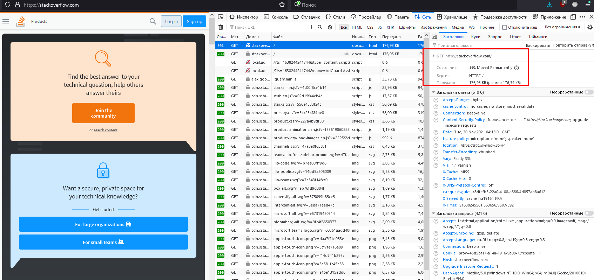
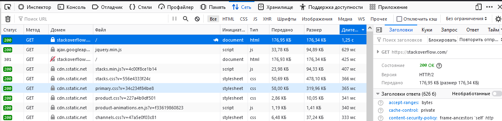
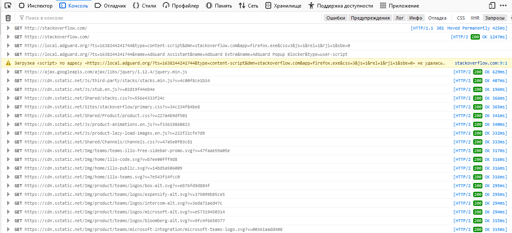

1. Цепляем телнетом к серверу на 80 порт, передаем пару команд.
```
kvazik@myagkikh:~$ telnet stackoverflow.com 80
Trying 151.101.65.69...
Connected to stackoverflow.com.
Escape character is '^]'.
GET /questions HTTP/1.0
HOST: stackoverflow.com

HTTP/1.1 301 Moved Permanently
cache-control: no-cache, no-store, must-revalidate
location: https://stackoverflow.com/questions
x-request-guid: ee278c6c-d0a0-40a4-b02c-d4917202acde
feature-policy: microphone 'none'; speaker 'none'
content-security-policy: upgrade-insecure-requests; frame-ancestors 'self' https://stackexchange.com
Accept-Ranges: bytes
Date: Tue, 30 Nov 2021 04:08:43 GMT
Via: 1.1 varnish
Connection: close
X-Served-By: cache-fra19177-FRA
X-Cache: MISS
X-Cache-Hits: 0
X-Timer: S1638245324.743364,VS0,VE92
Vary: Fastly-SSL
X-DNS-Prefetch-Control: off
Set-Cookie: prov=7256757c-f910-6f63-7311-03b29ac19b08; domain=.stackoverflow.com; expires=Fri, 01-Jan-2055 00:00:00 GMT; path=/; HttpOnly

Connection closed by foreign host.
```
На выходе получаем 301 код, постоянное перенаправление (редирект), которое означает, что запрос перенаправлен на другой хост.
Дальше пачка заголовков и закрытие соединения.

2. Открываем консоль, смотрим первый ответ и его заголовки. Так же видим 301 редирект на https://stackoverflow.com


Далее сортируемся по длительности и видимо что дольше всего отдавался корень, html документ.


Еще есть консоль (собственно что я и подразумеваю под самой консолью) где видно выполнение подгрузки файлов, работы скриптов и тд.


3. Открываем в браузере myip.ru и смотрим, какой именно адрес определяется для меня.
Не всегда это будет непосредственно адрес моего ПК в сети, зачастую это может быть серый адрес, который выделяется провайдером или при использовании proxy.
Ваш IP-адрес
86.102.120.103
Имя вашего хоста
relay2.mxgroup.ru

4. Мой адрес принадлежит к 18AS12332 провайдер ROSTELECOM-MNT. В данной конфигурации на моем роутере установлено три wan канала от разных провайдерв и далее по ДЗ могут меняться каналы исходящие и соответственно адреса.
```
inetnum:        86.102.120.96 - 86.102.120.111
netname:        POL-MEGATEXTRADING-NET
descr:          Megatex Trading Co Ltd
country:        RU
admin-c:        BPV2-RIPE
tech-c:         BPV2-RIPE
status:         ASSIGNED PA
mnt-by:         PRIMORYE-NCC-MNT
created:        2007-12-15T08:26:14Z
last-modified:  2012-06-27T12:34:41Z
source:         RIPE

person:         Pavel V Bronitskiy
address:        20a, Yumasheva st, Vladivostok, Russia
phone:          +7 4232 459952
nic-hdl:        BPV2-RIPE
mnt-by:         PRIMORYE-NCC-MNT
created:        2003-05-07T04:04:06Z
last-modified:  2003-05-07T04:04:06Z
source:         RIPE # Filtered

% Information related to '86.102.64.0/18AS12332'

route:          86.102.64.0/18
descr:          PRIMORYE NET
origin:         AS12332
mnt-by:         PRIMORYE-NCC-MNT
mnt-by:         ROSTELECOM-MNT
created:        2005-06-01T11:25:53Z
last-modified:  2019-03-14T22:33:47Z
source:         RIPE # Filtered
```

5. Делаем трассировку до 8.8.8.8 
```
kvazik@myagkikh:~$ traceroute -nA 8.8.8.8
traceroute to 8.8.8.8 (8.8.8.8), 30 hops max, 60 byte packets
 1  172.19.16.1 [*]  0.340 ms  0.238 ms  0.208 ms
 2  192.168.0.254 [*]  0.412 ms  0.603 ms  0.373 ms
 3  172.17.242.33 [*]  1.509 ms  1.426 ms  1.284 ms
 4  109.126.1.237 [AS42038]  1.267 ms  1.259 ms  1.234 ms
 5  109.126.0.242 [AS42038]  1.342 ms  1.125 ms  1.319 ms
 6  109.126.0.245 [AS42038]  1.050 ms  1.409 ms  1.385 ms
 7  109.126.1.158 [AS42038]  4.568 ms  4.547 ms  4.513 ms
 8  87.226.230.197 [AS12389]  1.735 ms  1.721 ms  1.497 ms
 9  87.226.181.89 [AS12389]  113.703 ms 87.226.183.89 [AS12389]  114.088 ms 87.226.181.89 [AS12389]  113.686 ms
10  5.143.253.105 [AS12389]  117.931 ms  118.132 ms 5.143.253.245 [AS12389]  111.215 ms
11  108.170.250.130 [AS15169]  114.579 ms 108.170.250.146 [AS15169]  132.475 ms 108.170.250.130 [AS15169]  114.595 ms
12  * * 172.253.66.116 [AS15169]  136.757 ms
13  74.125.253.94 [AS15169]  136.693 ms 216.239.48.224 [AS15169]  127.551 ms 172.253.65.82 [AS15169]  133.060 ms
14  172.253.51.219 [AS15169]  135.630 ms 172.253.51.187 [AS15169]  127.336 ms 172.253.79.237 [AS15169]  132.616 ms
15  * * *
16  * * *
17  * * *
18  * * *
19  * * *
20  * * *
21  * * *
22  * * 8.8.8.8 [AS15169]  133.148 ms
```

6. Трассируемся до 8.8.8.8 через mtr.
```
myagkikh (172.19.31.87) -> 8.8.8.8                                                                2021-11-30T14:33:17+1000
Keys:  Help   Display mode   Restart statistics   Order of fields   quit
                                                                                  Packets               Pings
 Host                                                                           Loss%   Snt   Last   Avg  Best  Wrst StDev
 1. myagkikh.mshome.net                                                          0.0%   175    1.1   0.5   0.2   2.8   0.4
 2. 192.168.0.254                                                                0.0%   175    0.7   1.4   0.3  13.0   1.9
 3. 10.8.8.80                                                                    0.0%   175   10.9   3.2   0.9  35.3   3.7
    213.87.100.129
    172.17.242.33
 4. 10.8.12.161                                                                  1.1%   175    9.2   5.7   0.9  40.3   6.0
    10.221.128.207
    109.126.1.237
 5. 10.8.12.50                                                                   0.0%   175    2.0   3.4   0.9  25.3   2.7
    10.156.131.122
    109.126.0.242
 6. T-2.30040.primorye.net.ru                                                    0.0%   175    1.6   3.9   1.0  44.1   4.5
    10.255.25.6
    109.126.0.245
 7. 87.226.183.89                                                                0.0%   175  109.0  38.4   1.7 134.9  50.5
    sneg-cr02-ae10.201.vldv.mts-internet.net
    po44-50-20g.asr9k-br.core.vladlink.net
 8. 74.125.52.232                                                                2.9%   175  104.2  98.1   1.3 224.8  36.3
    psheh-cr01-ae0.25.heh.mts-internet.net
    87.226.230.197
 9. 108.170.250.83                                                               5.7%   175  107.7 112.0 104.2 155.3   7.0
    psskv-cr01-ae1.27.skv.mts-internet.net
    87.226.181.89
10. pstyn-cr01-ae3.128.tnd.mts-internet.net                                     68.8%   174   27.4 107.3  27.4 136.5  33.7
    209.85.249.158
    5.143.253.245
11. 108.170.235.204                                                             30.5%   174  127.3  96.5  46.2 159.8  39.0
    bgs-cr01-ae4.28.bra.mts-internet.net
    108.170.250.113
12. 172.253.64.57                                                               67.2%   174  123.3 124.8 111.6 136.0   3.2
    142.251.49.158
    pskras-cr01-ae3.38.krsk.mts-internet.net
13. stn-cr01-be9.54.nsk.mts-internet.net                                        31.2%   174   62.6  74.1  61.4 142.8  25.5
    74.125.253.94
14. zoo-cr03-be8.66.ekt.mts-internet.net                                        31.8%   174   83.4  90.4  82.1 131.9  15.7
    216.239.62.9
15. vish-cr01-be7.66.kaz.mts-internet.net                                       42.2%   174   98.9  99.6  98.0 110.9   2.0
16. mag9-cr02-be6.16.msk.mts-internet.net                                       43.4%   174  117.2 118.3 116.6 128.0   2.4
17. mag9-cr01-be16.77.msk.mts-internet.net                                      42.8%   174  111.1 111.6 110.0 130.0   2.7
18. 108.170.250.130                                                             46.2%   174  112.2 113.1 111.6 120.6   1.7
19. 209.85.255.136                                                              62.4%   174  133.2 134.6 132.6 143.3   2.6
20. 72.14.238.168                                                               44.5%   174  137.6 135.9 131.8 165.9   6.3
21. (waiting for reply)
22. dns.google                                                                  86.7%   174  122.8 123.1 120.8 133.9   2.7
```

Наиболее отвратительно выглядит работа сегмента сети на МТС, большая задержка на хопах с 15 по 20.
так же по работе утилиты видно, что периодически роутер заворачивает пакеты в разные каналы и соответственно адреса в хопах разные встречаются.

7. Смотрим dig на dns.google
```
kvazik@myagkikh:~$ dig dns.google

; <<>> DiG 9.16.22-Debian <<>> dns.google
;; global options: +cmd
;; Got answer:
;; ->>HEADER<<- opcode: QUERY, status: NOERROR, id: 15014
;; flags: qr rd ad; QUERY: 1, ANSWER: 2, AUTHORITY: 0, ADDITIONAL: 0
;; WARNING: recursion requested but not available

;; QUESTION SECTION:
;dns.google.                    IN      A

;; ANSWER SECTION:
dns.google.             0       IN      A       8.8.4.4
dns.google.             0       IN      A       8.8.8.8

;; Query time: 10 msec
;; SERVER: 172.19.16.1#53(172.19.16.1)
;; WHEN: Tue Nov 30 14:37:05 +10 2021
;; MSG SIZE  rcvd: 70
```

за имя отвечают пара серверов 8.8.8.8 8.8.4.4

8. Смотрим dig запрос.
```
kvazik@myagkikh:~$ dig -x 8.8.8.8

; <<>> DiG 9.16.22-Debian <<>> -x 8.8.8.8
;; global options: +cmd
;; Got answer:
;; ->>HEADER<<- opcode: QUERY, status: NOERROR, id: 44087
;; flags: qr rd ad; QUERY: 1, ANSWER: 1, AUTHORITY: 0, ADDITIONAL: 0
;; WARNING: recursion requested but not available

;; QUESTION SECTION:
;8.8.8.8.in-addr.arpa.          IN      PTR

;; ANSWER SECTION:
8.8.8.8.in-addr.arpa.   0       IN      PTR     dns.google.

;; Query time: 0 msec
;; SERVER: 172.19.16.1#53(172.19.16.1)
;; WHEN: Tue Nov 30 14:40:34 +10 2021
;; MSG SIZE  rcvd: 82
```

PTR Запись для сервера 8.8.8.8 8.8.8.8.in-addr.arpa.

