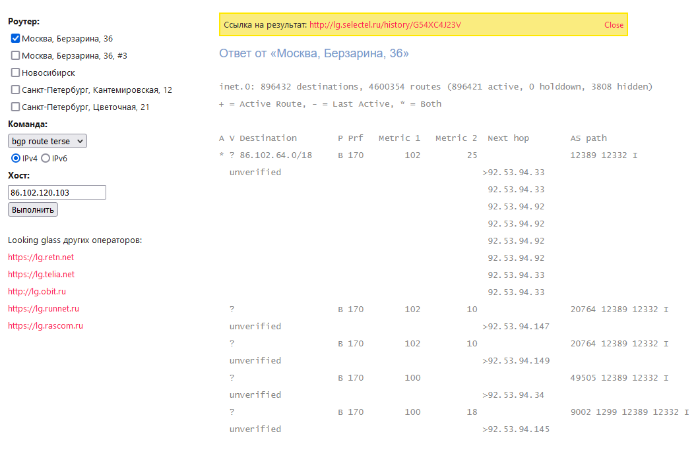
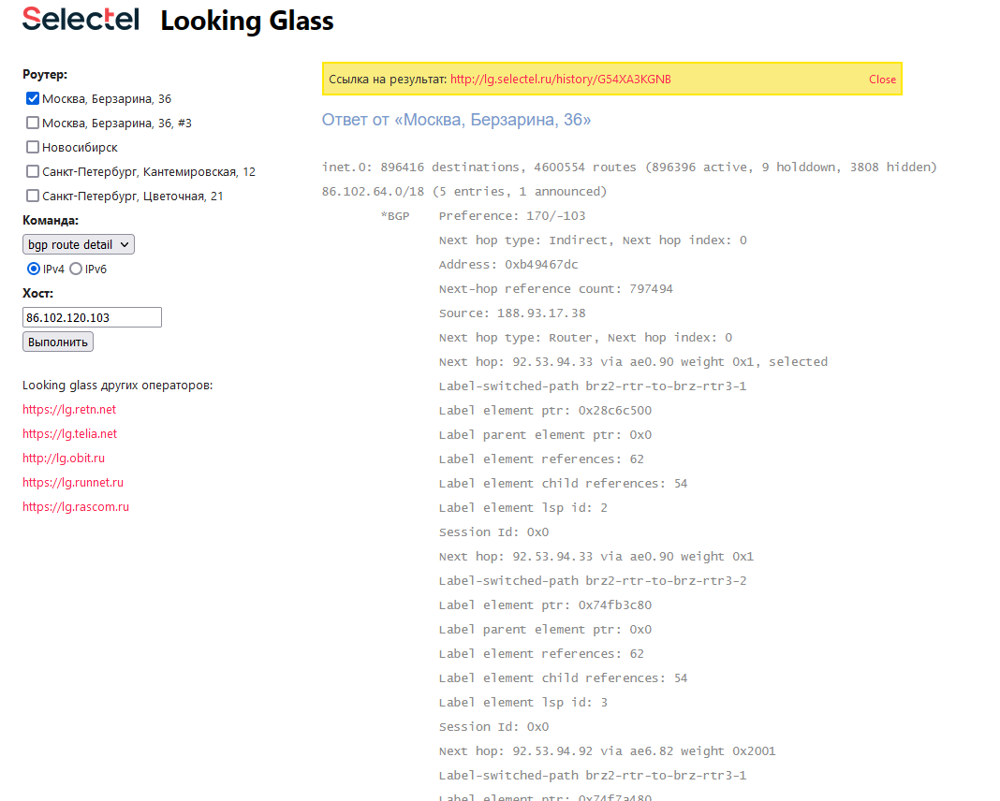

1. Подключитесь к публичному маршрутизатору в интернет. Найдите маршрут к вашему публичному IP

Пользуюсь обычно, если надо, через lg от провайдера. Можно посмотреть конечно и в публичном маршрутизаторе, но он не отвечает на текущий момент.
Надеюсь пары скриншотов достаточно, чтобы понять что к чему.



2. Создайте dummy0 интерфейс в Ubuntu. Добавьте несколько статических маршрутов. Проверьте таблицу маршрутизации.

```
root@ozprod-dev:~# ifconfig dummy0
dummy0: flags=130<BROADCAST,NOARP>  mtu 1500
        inet 10.10.10.1  netmask 255.255.255.0  broadcast 0.0.0.0
        ether e2:55:69:e6:28:6c  txqueuelen 1000  (Ethernet)
        RX packets 0  bytes 0 (0.0 B)
        RX errors 0  dropped 0  overruns 0  frame 0
        TX packets 0  bytes 0 (0.0 B)
        TX errors 0  dropped 0 overruns 0  carrier 0  collisions 0
```
Добавим маршрут в локалку, на хосте есть внешний интерфейс с дефолтным gw и мой статический. Без него с машины не видно другие локальные подсети 192.168.5.0 и тд.
route add -net 192.168.0.0 netmask 255.255.0.0 gw 192.168.0.254

```
Kernel IP routing table
Destination     Gateway         Genmask         Flags Metric Ref    Use Iface
default         213.87.100.129  0.0.0.0         UG    0      0        0 eth1
192.168.0.0     0.0.0.0         255.255.255.0   U     0      0        0 eth0
192.168.0.0     192.168.0.254   255.255.0.0     UG    0      0        0 eth0
213.87.100.0    0.0.0.0         255.255.255.0   U     0      0        0 eth1
```

3. Проверьте открытые TCP порты в Ubuntu, какие протоколы и приложения используют эти порты? Приведите несколько примеров.

```
 netstat -lp
Active Internet connections (only servers)
Proto Recv-Q Send-Q Local Address           Foreign Address         State       PID/Program name
tcp        0      0 0.0.0.0:22022           0.0.0.0:*               LISTEN      35134/sshd: /usr/sb
tcp        0      0 213.87.100.173:https    0.0.0.0:*               LISTEN      511/python3
tcp6       0      0 [::]:22022              [::]:*                  LISTEN      35134/sshd: /usr/sb
tcp6       0      0 [::]:zabbix-agent       [::]:*                  LISTEN      473/zabbix_agent2
```

У меня открыты порты 22022 под ssh (обычно прячу стандартный порт, чтобы не ломились боты), далее открыт https питоном (крутится tg бот) и поднят заббикс агент на стандартном порту.

4. В дебиан машине по умолчанию ничего не обнаружил на udp. Под рукой была Centos с битриксом, на нем оказались службы.

```
 netstat -aup
Active Internet connections (servers and established)
Proto Recv-Q Send-Q Local Address           Foreign Address         State       PID/Program name
udp        0      0 corp.mxgroup.ru:ntp     0.0.0.0:*                           573/ntpd
udp        0      0 localhost:ntp           0.0.0.0:*                           573/ntpd
udp        0      0 0.0.0.0:ntp             0.0.0.0:*                           573/ntpd
udp6       0      0 corp.mxgroup.ru:ntp     [::]:*                              573/ntpd
udp6       0      0 localhost:ntp           [::]:*                              573/ntpd
udp6       0      0 [::]:ntp                [::]:*                              573/ntpd
```

Судя по всему это банальный ntp протокол для синка времени. В целом upd используется в основном там, где не обязательно нужен контроль получения пакета. Например, видеостриминг, ip телефония.

5. Пример сети с двумя беспроводными маршрутизаторами, которые соединяют два сегмента сети через vpn.
network example.drawio

Сети привычнее рисовать в zabbix ибо там же сразу и все алерты видно и в целом сетевое пространство живое получается. Но для сохранения топологии редко меняющейся сети, наверное, подойдут и такие диаграмки.

6. Балансировщик на nginx установлен на одном из рабочих хостов. Шейпит трафик между несколькими хостами. Пример конфига:
vhost
```
server {
    server_name new.mxgroup.ru zakaz.mxgroup.ru;
    listen 80;
    set $srv new.mxgroup.ru;
    return 301 https://$srv$request_uri;
}
```
upstream
```
upstream new.mxgroup.ru {
#    ip_hash;
    hash $remote_addr$realip_remote_addr$session_uid consistent;
    server 192.168.0.56:80     weight=10 max_fails=3 fail_timeout=30s;
#    server 192.168.0.57:80     weight=10 max_fails=3 fail_timeout=30s;
#    server 192.168.0.4:80      weight=10 max_fails=3 fail_timeout=30s;
    server 192.168.0.16:80     weight=10 max_fails=3 fail_timeout=30s;
#    server 192.168.0.248:80    weight=10 max_fails=3 fail_timeout=30s;
}
```
Таким образом входящий на nginx трафик рулится внутри сети на несколько вебсерверов, можно выводить из работы некоторые, обновлять, балансировать нагрузку и тд.


