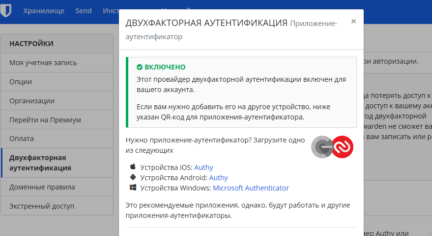

1 и 2 пункт




3. Поставил apache2 прописал vhost. Сертификат только не самоподписанный, а живой, и к нему цепочка сертификации. Слушать такой vhost должен порт 443.
Нужные параметры 

```
SSLCertificateFile /var/www/httpd-cert/mxgroupru/mxgroup_ru_20200918.bundle.crt
SSLCertificateKeyFile /var/www/httpd-cert/mxgroupru/mxgroup_ru_20200918.key


<VirtualHost *:443 >
        SSLCertificateFile /var/www/httpd-cert/mxgroupru/mxgroup_ru_20200918.bundle.crt
        SSLCertificateKeyFile /var/www/httpd-cert/mxgroupru/mxgroup_ru_20200918.key
        SSLEngine on
        SSLCertificateChainFile /var/www/httpd-cert/mxgroupru/.bundle
        ServerName mxgroup.ru
        CustomLog /var/www/httpd-logs/mxgroup.ru.access.log combined
        DocumentRoot /home/mxgroupru/www/mxgroup.ru
        ErrorLog /var/www/httpd-logs/mxgroup.ru.error.log
        ServerAdmin myagkikh@mxgroup.ru
        ServerAlias www.mxgroup.ru
        SuexecUserGroup mxgroupru mxgroupru
        AddType application/x-httpd-php .php .php3 .php4 .php5 .phtml
        AddType application/x-httpd-php-source .phps
        php_admin_value open_basedir "/home/mxgroupru:."
        php_admin_value sendmail_path "/usr/sbin/sendmail -t -i -f myagkikh@mxgroup.ru"
        php_admin_value upload_tmp_dir "/home/mxgroupru/mod-tmp"
        php_admin_value session.save_path "/home/mxgroupru/mod-tmp"
        php_admin_flag display_errors Off
        php_admin_value error_reporting 0
</VirtualHost>
```

Если нужно сгенерить собственный то запускаем такую команду. И данные этого сертифика вписываем в конфиг.
```
{10:22}~ ➭ sudo openssl req -x509 -nodes -days 365 -newkey rsa:2048 -keyout /etc/ssl/private/apache-selfsigned.key -out /etc/ssl/certs/apache-selfsigned.crt
Generating a RSA private key
................................................................+++++
..............................+++++
writing new private key to '/etc/ssl/private/apache-selfsigned.key'
-----
You are about to be asked to enter information that will be incorporated
into your certificate request.
What you are about to enter is what is called a Distinguished Name or a DN.
There are quite a few fields but you can leave some blank
For some fields there will be a default value,
If you enter '.', the field will be left blank.
-----
Country Name (2 letter code) [AU]:RU
State or Province Name (full name) [Some-State]:PK
Locality Name (eg, city) []:Vl
Organization Name (eg, company) [Internet Widgits Pty Ltd]:MX
Organizational Unit Name (eg, section) []:
Common Name (e.g. server FQDN or YOUR name) []:
Email Address []:
```


4. Скачал поставил утилитку testssl.sh
Вывод длинный, данных много полезных.
Кусок начала и итог
```
{17:35}/mnt/c/projects/testssl.sh:3.1dev ✓ ➭ bash testssl.sh mxgroup.ru


 Start 2021-12-14 17:35:56        -->> 192.168.0.246:443 (mxgroup.ru) <<--

 rDNS (192.168.0.246):   www.mxgroup.ru.
 Service detected:       HTTP


 Testing protocols via sockets except NPN+ALPN

 SSLv2      not offered (OK)
 SSLv3      not offered (OK)
 TLS 1      offered (deprecated)
 TLS 1.1    offered (deprecated)
 TLS 1.2    offered (OK)

 Rating (experimental)

 Rating specs (not complete)  SSL Labs's 'SSL Server Rating Guide' (version 2009q from 2020-01-30)
 Specification documentation  https://github.com/ssllabs/research/wiki/SSL-Server-Rating-Guide
 Protocol Support (weighted)  95 (28)
 Key Exchange     (weighted)  90 (27)
 Cipher Strength  (weighted)  90 (36)
 Final Score                  91
 Overall Grade                B
 Grade cap reasons            Grade capped to B. TLS 1.1 offered
                              Grade capped to B. TLS 1.0 offered
                              Grade capped to A. HSTS is not offered
```

5. Установите на Ubuntu ssh сервер, сгенерируйте новый приватный ключ. Скопируйте свой публичный ключ на другой сервер. Подключитесь к серверу по SSH-ключу.

```
sudo apt install ssh
ssh-keygen -t ed25519 

{10:45}~/.ssh ➭ ssh-copy-id -i id_ed25519.pub myagkikh@192.168.0.244
/usr/bin/ssh-copy-id: INFO: Source of key(s) to be installed: "id_ed25519.pub"
The authenticity of host '192.168.0.244 (192.168.0.244)' can't be established.
ECDSA key fingerprint is SHA256:JbohCxzs8eR7tP/xFTck8G7tJJ5ffEwNc9t3jIW4ghY.
Are you sure you want to continue connecting (yes/no/[fingerprint])? yes
/usr/bin/ssh-copy-id: INFO: attempting to log in with the new key(s), to filter out any that are already installed
/usr/bin/ssh-copy-id: INFO: 1 key(s) remain to be installed -- if you are prompted now it is to install the new keys
myagkikh@192.168.0.244's password:

Number of key(s) added: 1

Now try logging into the machine, with:   "ssh 'myagkikh@192.168.0.244'"
and check to make sure that only the key(s) you wanted were added.

{10:46}~/.ssh ➭ ssh myagkikh@192.168.0.244
Linux neptune 4.19.0-17-amd64 #1 SMP Debian 4.19.194-3 (2021-07-18) x86_64

```

6. Переименуйте файлы ключей из задания 5. Настройте файл конфигурации SSH клиента, так чтобы вход на удаленный сервер осуществлялся по имени сервера.

```
{10:56}~/.ssh ➭ ls
config  id_ed25519  id_ed25519.pub  id_neptune  id_neptune.pub  known_hosts
{10:57}~/.ssh ➭ cat config
host neptune
    User myagkikh
    IdentityFile ~/.ssh/id_neptune
    Hostname 192.168.0.244
    Port 22
    Protocol 2
{10:57}~/.ssh ➭ ssh neptune
Linux neptune 4.19.0-17-amd64 #1 SMP Debian 4.19.194-3 (2021-07-18) x86_64

The programs included with the Debian GNU/Linux system are free software;
the exact distribution terms for each program are described in the
individual files in /usr/share/doc/*/copyright.

Debian GNU/Linux comes with ABSOLUTELY NO WARRANTY, to the extent
permitted by applicable law.
Last login: Wed Dec 15 10:56:45 2021 from 192.168.0.174
```


7. Соберите дамп трафика утилитой tcpdump в формате pcap, 100 пакетов. Откройте файл pcap в Wireshark.

```
{11:01}~/.ssh ➭ sudo tcpdump -w dump.pcap -c 100
tcpdump: listening on eth0, link-type EN10MB (Ethernet), snapshot length 262144 bytes
100 packets captured
100 packets received by filter
0 packets dropped by kernel
```


8. Просканируйте хост scanme.nmap.org. Какие сервисы запущены?

Ставим netcat и пробуем посканить первые 1000 портов (обычно стандартные сервисы располоагаются именно в этом диапазоне)

```
{11:08}/mnt/c/GMSolaris/study:master ✗ ➭ nc -z -v scanme.nmap.org 20-1000
nc: connect to scanme.nmap.org (45.33.32.156) port 20 (tcp) failed: Connection refused
nc: connect to scanme.nmap.org (2600:3c01::f03c:91ff:fe18:bb2f) port 20 (tcp) failed: Network is unreachable
nc: connect to scanme.nmap.org (45.33.32.156) port 21 (tcp) failed: Connection refused
nc: connect to scanme.nmap.org (2600:3c01::f03c:91ff:fe18:bb2f) port 21 (tcp) failed: Network is unreachable
Connection to scanme.nmap.org (45.33.32.156) 22 port [tcp/ssh] succeeded!
nc: connect to scanme.nmap.org (45.33.32.156) port 23 (tcp) failed: Connection refused
nc: connect to scanme.nmap.org (2600:3c01::f03c:91ff:fe18:bb2f) port 23 (tcp) failed: Network is unreachable
nc: connect to scanme.nmap.org (45.33.32.156) port 24 (tcp) failed: Connection refused
nc: connect to scanme.nmap.org (2600:3c01::f03c:91ff:fe18:bb2f) port 24 (tcp) failed: Network is unreachable
nc: connect to scanme.nmap.org (45.33.32.156) port 25 (tcp) failed: Connection refused
nc: connect to scanme.nmap.org (2600:3c01::f03c:91ff:fe18:bb2f) port 25 (tcp) failed: Network is unreachable
nc: connect to scanme.nmap.org (45.33.32.156) port 26 (tcp) failed: Connection refused
nc: connect to scanme.nmap.org (2600:3c01::f03c:91ff:fe18:bb2f) port 26 (tcp) failed: Network is unreachable
nc: connect to scanme.nmap.org (45.33.32.156) port 27 (tcp) failed: Connection refused
nc: connect to scanme.nmap.org (2600:3c01::f03c:91ff:fe18:bb2f) port 27 (tcp) failed: Network is unreachable
nc: connect to scanme.nmap.org (45.33.32.156) port 28 (tcp) failed: Connection refused
```

Вывод довольно длинный и куча лишнего. Завернем это все в grep

```
{11:09}/mnt/c/GMSolaris/study:master ✗ ➭ nc -z -v scanme.nmap.org 20-1000 2>&1 | grep succeeded
Connection to scanme.nmap.org (45.33.32.156) 22 port [tcp/ssh] succeeded!
Connection to scanme.nmap.org (45.33.32.156) 80 port [tcp/http] succeeded!
```

Открыты пара портов, ssh 22 и 80 http

9. Ставим ufw, sudo apt install ufw, sudo ufw enable
Далее проверяем статус работы и заводим правила

```
{11:57}~ ➭ sudo ufw status
Status: active
{11:59}~ ➭ sudo ufw allow 22
Rules updated
Rules updated (v6)
{11:59}~ ➭ sudo ufw allow 80
Rules updated
Rules updated (v6)
{11:59}~ ➭ sudo ufw allow 443
Rules updated
Rules updated (v6)
```

