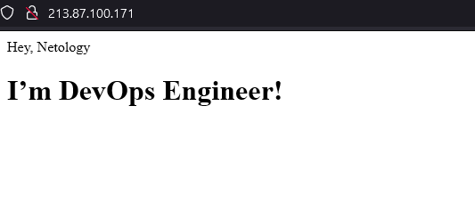

1. Сценарий выполения задачи:

создайте свой репозиторий на https://hub.docker.com;
- выполнено 

выберете любой образ, который содержит веб-сервер Nginx;
- берем самый первый офф образ nginx:stable на основе дебиана

создайте свой fork образа;
Делаем на основе этого образа свой, через Dockerfile. Заодно обновляем кеш пакетного менеджера и доставляем утилиту wget. Берем из интернета нужный файл, подменяем в nginx
```
FROM nginx:stable

MAINTAINER Alexander Myagkikh <kvazik.vl@gmail.com>

ENV TZ=Asia/Vladivostok

RUN apt update
RUN apt install wget
RUN wget https://mxgroup.ru/upload/index.html
RUN rm /usr/share/nginx/html/index.html
RUN cp index.html /usr/share/nginx/html/
```
Собираем образ 
```
myagkikh@netology:~/mynginx$ sudo docker build -t gmsolaris/nginx:v1 .
[sudo] пароль для myagkikh:
Sending build context to Docker daemon  2.048kB
Step 1/8 : FROM nginx:stable
 ---> d6c9558ba445
Step 2/8 : MAINTAINER Alexander Myagkikh <kvazik.vl@gmail.com>
 ---> Running in b794a7eaf87e
Removing intermediate container b794a7eaf87e
 ---> 0070df5cd16c
Step 3/8 : ENV TZ=Asia/Vladivostok
 ---> Running in ed4ebe6df1dd
Removing intermediate container ed4ebe6df1dd
 ---> 3c85615cad74
Step 4/8 : RUN apt update
 ---> Running in 8da4b7c78689
 ..........
```
реализуйте функциональность: запуск веб-сервера в фоне с индекс-страницей, содержащей HTML-код ниже:
Запускаем наш образ  sudo docker run -itd --name nginx_netology -p 80:80 gmsolaris/nginx:v1
Проверяем



Опубликуйте созданный форк в своем репозитории и предоставьте ответ в виде ссылки
docker pull gmsolaris/nginx
https://hub.docker.com/r/gmsolaris/nginx

2. Посмотрите на сценарий ниже и ответьте на вопрос: "Подходит ли в этом сценарии использование Docker контейнеров или лучше подойдет виртуальная машина, физическая машина? Может быть возможны разные варианты?"

Детально опишите и обоснуйте свой выбор.
Сценарий:

Высоконагруженное монолитное java веб-приложение;
- Не подходит. Для высоконагруженных монолитов лучше подойдет виртуальная машина или даже физический сервер.

Nodejs веб-приложение;
- Прекрасно подойдет докер. Легковесные приложения, которым требуется в разное время разное кол-во ресурсов и практически не нужна объемная дисковая.

Мобильное приложение c версиями для Android и iOS;
- Так же прекрасно подойдет докер. Легковесные приложения, которым требуется в разное время разное кол-во ресурсов и практически не нужна объемная дисковая.
Шина данных на базе Apache Kafka;
- Не совсем знаком с шиной на базе Kafka, но в целом шина данных это набор микросервисов с небольшим но быстро изменающимся дисковым, где постоянно идет какой-то обмен. Докер вполне подойдет.

Elasticsearch кластер для реализации логирования продуктивного веб-приложения - три ноды elasticsearch, два logstash и две ноды kibana;
-  Тут вполне подойдет и докер и виртуальные машины. В целом докер лучше, так как эту инфраструктуру придется масштабировать и докер очень под это подохдит.

Мониторинг-стек на базе Prometheus и Grafana;
- Это однозначно докер. На любой уже работающий в проде сервер просто подкидываем контейнеры и начинаем мониторить сразу нужные метрики.

MongoDB, как основное хранилище данных для java-приложения;
- Для баз данных конечно докер используют и часто. Особенно когда надо собирать кластера. Я не всегда придерживаюсь такой практики. Чаще поднимаю базы данных как отдельные виртуалки или даже физические сервера. Для баз данных куда важнее иметь отказоустойчивость, то есть реплики, бекапы, зеркала.

Gitlab сервер для реализации CI/CD процессов и приватный (закрытый) Docker Registry.
- Вот это точно проще развернуть на виртуалке. Явно операция поднятия гитлаб сервера это не самое регулярное действие. К тому же хранить докер регистри внутри докера - плохая затея. При любых проблемах с докером вы теряете сразу и весь регистри, откуда можно было бы утянуть нужные контейнеры.

3. 

    Запустите первый контейнер из образа centos c любым тэгом в фоновом режиме, подключив папку /data из текущей рабочей директории на хостовой машине в /data контейнера;
    Запустите второй контейнер из образа debian в фоновом режиме, подключив папку /data из текущей рабочей директории на хостовой машине в /data контейнера;
    Подключитесь к первому контейнеру с помощью docker exec и создайте текстовый файл любого содержания в /data;
    Добавьте еще один файл в папку /data на хостовой машине;
    Подключитесь во второй контейнер и отобразите листинг и содержание файлов в /data контейнера.


```
myagkikh@netology:/$ sudo docker run --name centos -v /data:/data -itd centos:latest
9c810aceb5a02b3f6d28bd607dde392d165481803ca08a9e7d8e9e0578f1667e
myagkikh@netology:/$ sudo docker run --name debian -v /data:/data -itd debian:latest
831b411c6ca8da54dee1a05c39611bfde03a37f4a674eac672af9ddfbcce819d
myagkikh@netology:/$ sudo docker ps
CONTAINER ID   IMAGE                COMMAND                  CREATED          STATUS          PORTS                               NAMES
831b411c6ca8   debian:latest        "bash"                   5 seconds ago    Up 4 seconds                                        debian
9c810aceb5a0   centos:latest        "/bin/bash"              17 seconds ago   Up 16 seconds                                       centos
05dd85479d50   gmsolaris/nginx:v1   "/docker-entrypoint.…"   3 hours ago      Up 3 hours      0.0.0.0:80->80/tcp, :::80->80/tcp   nginx_netology
myagkikh@netology:/$ cd data
myagkikh@netology:/data$ ls -lh
итого 0
myagkikh@netology:/data$ sudo docker exec centos touch /data/netology_5.3_centos
myagkikh@netology:/data$ sudo docker exec debian touch /data/netology_5.3_debian
myagkikh@netology:/data$ sudo touch host_machine
myagkikh@netology:/data$ ls -lh
итого 0
-rw-r--r-- 1 root root 0 янв 31 20:28 host_machine
-rw-r--r-- 1 root root 0 янв 31 20:27 netology_5.3_centos
-rw-r--r-- 1 root root 0 янв 31 20:28 netology_5.3_debian
myagkikh@netology:/data$ sudo docker exec debian ls -lh data
total 0
-rw-r--r-- 1 root root 0 Jan 31 10:28 host_machine
-rw-r--r-- 1 root root 0 Jan 31 10:27 netology_5.3_centos
-rw-r--r-- 1 root root 0 Jan 31 10:28 netology_5.3_debian
myagkikh@netology:/data$ sudo docker exec centos ls -lh data
total 0
-rw-r--r-- 1 root root 0 Jan 31 10:28 host_machine
-rw-r--r-- 1 root root 0 Jan 31 10:27 netology_5.3_centos
-rw-r--r-- 1 root root 0 Jan 31 10:28 netology_5.3_debian
```

4. Воспроизвести практическую часть лекции самостоятельно.

Соберите Docker образ с Ansible, загрузите на Docker Hub и пришлите ссылку вместе с остальными ответами к задачам.
https://hub.docker.com/repository/docker/gmsolaris/ansible

