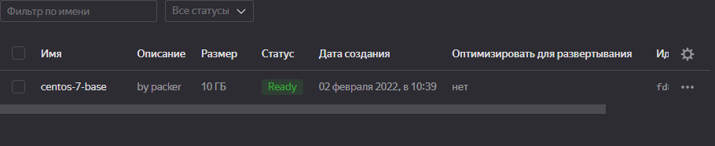
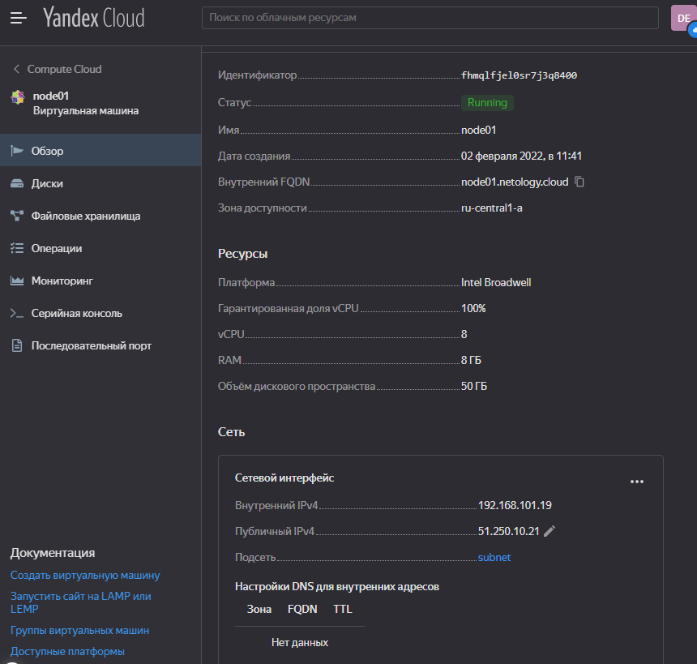
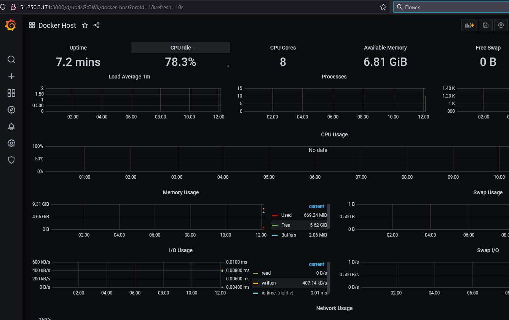
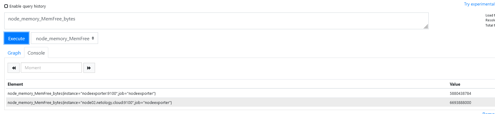
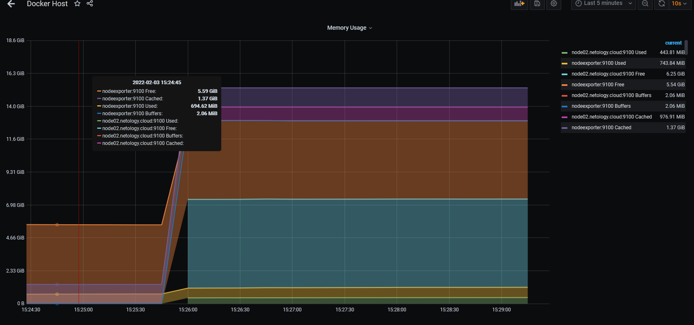

1. 
Создать собственный образ операционной системы с помощью Packer.
```
myagkikh@netology:~$ yc vpc network create \
> --name net \
> --labels my-label=netology \
> --description "my net"
id: enp1t4gmji4mqim6edek
folder_id: b1gep2e6rvv6hn2eghpg
created_at: "2022-02-02T00:11:27Z"
name: net
description: my net
labels:
  my-label: netology

myagkikh@netology:~$ yc vpc subnet create \
> --name my-subnet-a \
> --zone ru-central1-a \
> --range 10.1.2.0/24 \
> --network-name net \
> --description "my subnet"
id: e9bstgfm5r5n11i1gq3u
folder_id: b1gep2e6rvv6hn2eghpg
created_at: "2022-02-02T00:13:11Z"
name: my-subnet-a
description: my subnet
network_id: enp1t4gmji4mqim6edek
zone_id: ru-central1-a
v4_cidr_blocks:
- 10.1.2.0/24
```
Для получения зачета, вам необходимо предоставить:
```
myagkikh@netology:~/packer$ packer build centos-7-base.json
yandex: output will be in this color.

==> yandex: Creating temporary RSA SSH key for instance...
==> yandex: Using as source image: fd8aqitd4vl5950ihohp (name: "centos-7-v20220131", family: "centos-7")
==> yandex: Use provided subnet id e9bstgfm5r5n11i1gq3u
==> yandex: Creating disk...
==> yandex: Creating instance...
==> yandex: Waiting for instance with id fhms2t3cobj499f8h7t1 to become active...
    yandex: Detected instance IP: 51.250.10.36
==> yandex: Using SSH communicator to connect: 51.250.10.36
==> yandex: Waiting for SSH to become available...
==> yandex: Connected to SSH!
==> yandex: Provisioning with shell script: /tmp/packer-shell365282359
    yandex: Loaded plugins: fastestmirror
    yandex: Loading mirror speeds from cached hostfile
    yandex:  * base: mirror.yandex.ru
    yandex:  * extras: mirror.docker.ru
    yandex:  * updates: mirror.yandex.ru
    yandex: No packages marked for update
    yandex: Loaded plugins: fastestmirror
    yandex: Loading mirror speeds from cached hostfile
    yandex:  * base: mirror.yandex.ru
    yandex:  * extras: mirror.docker.ru
    yandex:  * updates: mirror.yandex.ru
    yandex: Package iptables-1.4.21-35.el7.x86_64 already installed and latest version
    yandex: Package curl-7.29.0-59.el7_9.1.x86_64 already installed and latest version
    yandex: Package net-tools-2.0-0.25.20131004git.el7.x86_64 already installed and latest version
    yandex: Package rsync-3.1.2-10.el7.x86_64 already installed and latest version
    yandex: Package openssh-server-7.4p1-22.el7_9.x86_64 already installed and latest version
    yandex: Resolving Dependencies
    yandex: --> Running transaction check
    yandex: ---> Package bind-utils.x86_64 32:9.11.4-26.P2.el7_9.8 will be installed
    yandex: --> Processing Dependency: bind-libs-lite(x86-64) = 32:9.11.4-26.P2.el7_9.8 for package: 32:bind-utils-9.11.4-26.P2.el7_9.8.x86_64
    yandex: --> Processing Dependency: bind-libs(x86-64) = 32:9.11.4-26.P2.el7_9.8 for package: 32:bind-utils-9.11.4-26.P2.el7_9.8.x86_64
    yandex: --> Processing Dependency: liblwres.so.160()(64bit) for package: 32:bind-utils-9.11.4-26.P2.el7_9.8.x86_64
    yandex: --> Processing Dependency: libisccfg.so.160()(64bit) for package: 32:bind-utils-9.11.4-26.P2.el7_9.8.x86_64
    yandex: --> Processing Dependency: libisc.so.169()(64bit) for package: 32:bind-utils-9.11.4-26.P2.el7_9.8.x86_64
    yandex: --> Processing Dependency: libirs.so.160()(64bit) for package: 32:bind-utils-9.11.4-26.P2.el7_9.8.x86_64
    yandex: --> Processing Dependency: libdns.so.1102()(64bit) for package: 32:bind-utils-9.11.4-26.P2.el7_9.8.x86_64
    yandex: --> Processing Dependency: libbind9.so.160()(64bit) for package: 32:bind-utils-9.11.4-26.P2.el7_9.8.x86_64
    yandex: --> Processing Dependency: libGeoIP.so.1()(64bit) for package: 32:bind-utils-9.11.4-26.P2.el7_9.8.x86_64
    yandex: ---> Package bridge-utils.x86_64 0:1.5-9.el7 will be installed
    yandex: ---> Package tcpdump.x86_64 14:4.9.2-4.el7_7.1 will be installed
    yandex: --> Processing Dependency: libpcap >= 14:1.5.3-10 for package: 14:tcpdump-4.9.2-4.el7_7.1.x86_64
    yandex: --> Processing Dependency: libpcap.so.1()(64bit) for package: 14:tcpdump-4.9.2-4.el7_7.1.x86_64
    yandex: ---> Package telnet.x86_64 1:0.17-66.el7 will be installed
    yandex: --> Running transaction check
    yandex: ---> Package GeoIP.x86_64 0:1.5.0-14.el7 will be installed
    yandex: --> Processing Dependency: geoipupdate for package: GeoIP-1.5.0-14.el7.x86_64
    yandex: ---> Package bind-libs.x86_64 32:9.11.4-26.P2.el7_9.8 will be installed
    yandex: --> Processing Dependency: bind-license = 32:9.11.4-26.P2.el7_9.8 for package: 32:bind-libs-9.11.4-26.P2.el7_9.8.x86_64
    yandex: ---> Package bind-libs-lite.x86_64 32:9.11.4-26.P2.el7_9.8 will be installed
    yandex: ---> Package libpcap.x86_64 14:1.5.3-12.el7 will be installed
    yandex: --> Running transaction check
    yandex: ---> Package bind-license.noarch 32:9.11.4-26.P2.el7_9.8 will be installed
    yandex: ---> Package geoipupdate.x86_64 0:2.5.0-1.el7 will be installed
    yandex: --> Finished Dependency Resolution
    yandex:
    yandex: Dependencies Resolved
    yandex:
    yandex: ================================================================================
    yandex:  Package            Arch       Version                        Repository   Size
    yandex: ================================================================================
    yandex: Installing:
    yandex:  bind-utils         x86_64     32:9.11.4-26.P2.el7_9.8        updates     261 k
    yandex:  bridge-utils       x86_64     1.5-9.el7                      base         32 k
    yandex:  tcpdump            x86_64     14:4.9.2-4.el7_7.1             base        422 k
    yandex:  telnet             x86_64     1:0.17-66.el7                  updates      64 k
    yandex: Installing for dependencies:
    yandex:  GeoIP              x86_64     1.5.0-14.el7                   base        1.5 M
    yandex:  bind-libs          x86_64     32:9.11.4-26.P2.el7_9.8        updates     157 k
    yandex:  bind-libs-lite     x86_64     32:9.11.4-26.P2.el7_9.8        updates     1.1 M
    yandex:  bind-license       noarch     32:9.11.4-26.P2.el7_9.8        updates      91 k
    yandex:  geoipupdate        x86_64     2.5.0-1.el7                    base         35 k
    yandex:  libpcap            x86_64     14:1.5.3-12.el7                base        139 k
    yandex:
    yandex: Transaction Summary
    yandex: ================================================================================
    yandex: Install  4 Packages (+6 Dependent packages)
    yandex:
    yandex: Total download size: 3.8 M
    yandex: Installed size: 9.0 M
    yandex: Downloading packages:
    yandex: --------------------------------------------------------------------------------
    yandex: Total                                              7.8 MB/s | 3.8 MB  00:00
    yandex: Running transaction check
    yandex: Running transaction test
    yandex: Transaction test succeeded
    yandex: Running transaction
    yandex:   Installing : 32:bind-license-9.11.4-26.P2.el7_9.8.noarch                 1/10
    yandex:   Installing : geoipupdate-2.5.0-1.el7.x86_64                              2/10
    yandex:   Installing : GeoIP-1.5.0-14.el7.x86_64                                   3/10
    yandex:   Installing : 32:bind-libs-lite-9.11.4-26.P2.el7_9.8.x86_64               4/10
    yandex:   Installing : 32:bind-libs-9.11.4-26.P2.el7_9.8.x86_64                    5/10
    yandex:   Installing : 14:libpcap-1.5.3-12.el7.x86_64                              6/10
    yandex: pam_tally2: Error opening /var/log/tallylog for update: Permission denied
    yandex: pam_tally2: Authentication error
    yandex: useradd: failed to reset the tallylog entry of user "tcpdump"
    yandex:   Installing : 14:tcpdump-4.9.2-4.el7_7.1.x86_64                           7/10
    yandex:   Installing : 32:bind-utils-9.11.4-26.P2.el7_9.8.x86_64                   8/10
    yandex:   Installing : bridge-utils-1.5-9.el7.x86_64                               9/10
    yandex:   Installing : 1:telnet-0.17-66.el7.x86_64                                10/10
    yandex:   Verifying  : GeoIP-1.5.0-14.el7.x86_64                                   1/10
    yandex:   Verifying  : 1:telnet-0.17-66.el7.x86_64                                 2/10
    yandex:   Verifying  : 14:libpcap-1.5.3-12.el7.x86_64                              3/10
    yandex:   Verifying  : geoipupdate-2.5.0-1.el7.x86_64                              4/10
    yandex:   Verifying  : 14:tcpdump-4.9.2-4.el7_7.1.x86_64                           5/10
    yandex:   Verifying  : 32:bind-license-9.11.4-26.P2.el7_9.8.noarch                 6/10
    yandex:   Verifying  : 32:bind-libs-lite-9.11.4-26.P2.el7_9.8.x86_64               7/10
    yandex:   Verifying  : 32:bind-utils-9.11.4-26.P2.el7_9.8.x86_64                   8/10
    yandex:   Verifying  : 32:bind-libs-9.11.4-26.P2.el7_9.8.x86_64                    9/10
    yandex:   Verifying  : bridge-utils-1.5-9.el7.x86_64                              10/10
    yandex:
    yandex: Installed:
    yandex:   bind-utils.x86_64 32:9.11.4-26.P2.el7_9.8   bridge-utils.x86_64 0:1.5-9.el7
    yandex:   tcpdump.x86_64 14:4.9.2-4.el7_7.1           telnet.x86_64 1:0.17-66.el7
    yandex:
    yandex: Dependency Installed:
    yandex:   GeoIP.x86_64 0:1.5.0-14.el7
    yandex:   bind-libs.x86_64 32:9.11.4-26.P2.el7_9.8
    yandex:   bind-libs-lite.x86_64 32:9.11.4-26.P2.el7_9.8
    yandex:   bind-license.noarch 32:9.11.4-26.P2.el7_9.8
    yandex:   geoipupdate.x86_64 0:2.5.0-1.el7
    yandex:   libpcap.x86_64 14:1.5.3-12.el7
    yandex:
    yandex: Complete!
==> yandex: Stopping instance...
==> yandex: Deleting instance...
    yandex: Instance has been deleted!
==> yandex: Creating image: centos-7-base
==> yandex: Waiting for image to complete...
==> yandex: Success image create...
==> yandex: Destroying boot disk...
    yandex: Disk has been deleted!
Build 'yandex' finished after 2 minutes 9 seconds.

==> Wait completed after 2 minutes 9 seconds

==> Builds finished. The artifacts of successful builds are:
--> yandex: A disk image was created: centos-7-base (id: fd8mlhvvmuss2liqq0i4) with family name centos

myagkikh@netology:~/packer$ yc compute image list
+----------------------+---------------+--------+----------------------+--------+
|          ID          |     NAME      | FAMILY |     PRODUCT IDS      | STATUS |
+----------------------+---------------+--------+----------------------+--------+
| fd8mlhvvmuss2liqq0i4 | centos-7-base | centos | f2eacrudv331nbat9ehb | READY  |
+----------------------+---------------+--------+----------------------+--------+


```
Скриншот страницы, как на слайде из презентации (слайд 37).


2. Создать вашу первую виртуальную машину в Яндекс.Облаке.
```
Apply complete! Resources: 3 added, 0 changed, 0 destroyed.

Outputs:

external_ip_address_node01_yandex_cloud = "51.250.10.21"
internal_ip_address_node01_yandex_cloud = "192.168.101.19"
```

Для получения зачета, вам необходимо предоставить cкриншот страницы свойств созданной ВМ:


Не забываем удалить машину после успешного запуска!

3. Создать ваш первый готовый к боевой эксплуатации компонент мониторинга, состоящий из стека микросервисов.

Для получения зачета, вам необходимо предоставить скриншот работающего веб-интерфейса Grafana с текущими метриками (адрес поменялся, так как предыдущую машину уничтожил и занова пересоздал для п3):



4. Создать вторую ВМ и подключить её к мониторингу развёрнутому на первом сервере.

Для получения зачета, вам необходимо предоставить скриншот из Grafana, на котором будут отображаться метрики добавленного вами сервера.

Поднимаем второй инстанс через терраформ:
```
resource "yandex_compute_instance" "node02" {
  name                      = "node02"
  zone                      = "ru-central1-a"
  hostname                  = "node02.netology.cloud"
  allow_stopping_for_update = true

  resources {
    cores  = 8
    memory = 8
  }

  boot_disk {
    initialize_params {
      image_id    = "${var.centos-7-base}"
      name        = "root-node02"
      type        = "network-nvme"
      size        = "50"
    }
  }

  network_interface {
    subnet_id = "${yandex_vpc_subnet.default.id}"
    nat       = true
  }

  metadata = {
    ssh-keys = "centos:${file("~/.ssh/id_rsa.pub")}"
  }
}

```

Добавляем в плейбук ansible для него настройки: 

```
 - hosts: node2
    become: yes
    become_user: root
    remote_user: centos

    tasks:
      - name: Create directory for ssh-keys
        file: state=directory mode=0700 dest=/root/.ssh/

      - name: Adding rsa-key in /root/.ssh/authorized_keys
        copy: src=~/.ssh/id_rsa.pub dest=/root/.ssh/authorized_keys owner=root mode=0600
        ignore_errors: yes

      - name: Checking DNS
        command: host -t A google.com

      - name: Installing tools
        yum: >
          package={{ item }}
          state=present
          update_cache=yes
        with_items:
          - git
          - curl

      - name: Add docker repository
        command: yum-config-manager --add-repo https://download.docker.com/linux/centos/docker-ce.repo

      - name: Installing docker package
        yum: >
          package={{ item }}
          state=present
          update_cache=yes
        with_items:
          - docker-ce
          - docker-ce-cli
          - containerd.io

      - name: Enable docker daemon
        systemd:
          name: docker
          state: started
          enabled: yes

      - name: Install docker-compose
        raw: $(curl -L https://github.com/docker/compose/releases/download/1.29.2/docker-compose-`uname -s`-`uname -m` -o /usr/bin/docker-compose && chmod +x /usr/bin/docker-compose)

      - name: Synchronization
        copy:
          src: stack/
          dest: "/opt/stack/"
          owner: root
          group: root
          mode: 0644
        become: true

      - name: Pull all images in compose
        command: docker-compose -f /opt/stack/exporters/docker-compose.exporters.yaml pull

      - name: Up all services in compose
        command: docker-compose -f /opt/stack/exporters/docker-compose.exporters.yaml up -d
```

Состав docker-compose.exporters.yaml
```
version: '2.1'

services:

  nodeexporter:
    image: prom/node-exporter:v0.18.1
    container_name: nodeexporter
    volumes:
      - /proc:/host/proc:ro
      - /sys:/host/sys:ro
      - /:/rootfs:ro
    command:
      - '--path.procfs=/host/proc'
      - '--path.rootfs=/rootfs'
      - '--path.sysfs=/host/sys'
      - '--collector.filesystem.ignored-mount-points=^/(sys|proc|dev|host|etc)($$|/)'
    restart: unless-stopped
    network_mode: host
    labels:
      org.label-schema.group: "monitoring"

  cadvisor:
    image: gcr.io/google-containers/cadvisor:v0.34.0
    container_name: cadvisor
    volumes:
      - /:/rootfs:ro
      - /var/run:/var/run:rw
      - /sys:/sys:ro
      - /var/lib/docker/:/var/lib/docker:ro
      - /cgroup:/cgroup:ro
    restart: unless-stopped
    network_mode: host
    labels:
      org.label-schema.group: "monitoring"
```

В конифеге prometeus.yml добавляем вторую ноду для сбора информации:
```
# A scrape configuration containing exactly one endpoint to scrape.
scrape_configs:
  - job_name: 'nodeexporter'
    scrape_interval: 5s
    static_configs:
      - targets: ['nodeexporter:9100', 'node02.netology.cloud:9100']

  - job_name: 'cadvisor'
    scrape_interval: 5s
    static_configs:
      - targets: ['cadvisor:8080', 'node02.netology.cloud:8080']
```
В конфиге дашборда графаны правим везде поле 
"legendFormat": " на "legendFormat": "{{instance}}

Проверяем что прометей собирает данные


В итоге на дашборды начинает выгружаться картинка со второй ноды. Ну и если нод будет 10 то со всех 10.



