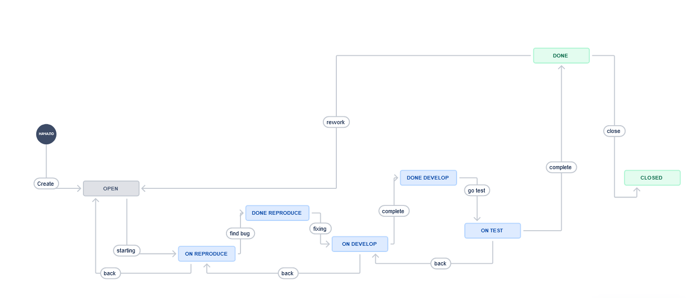
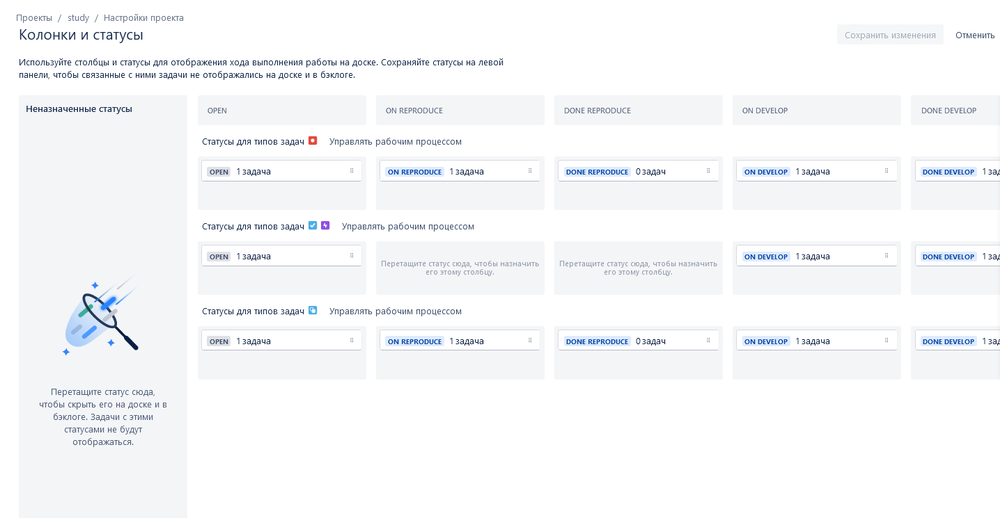
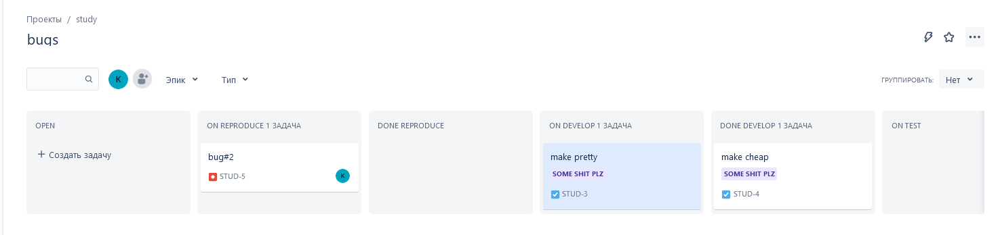
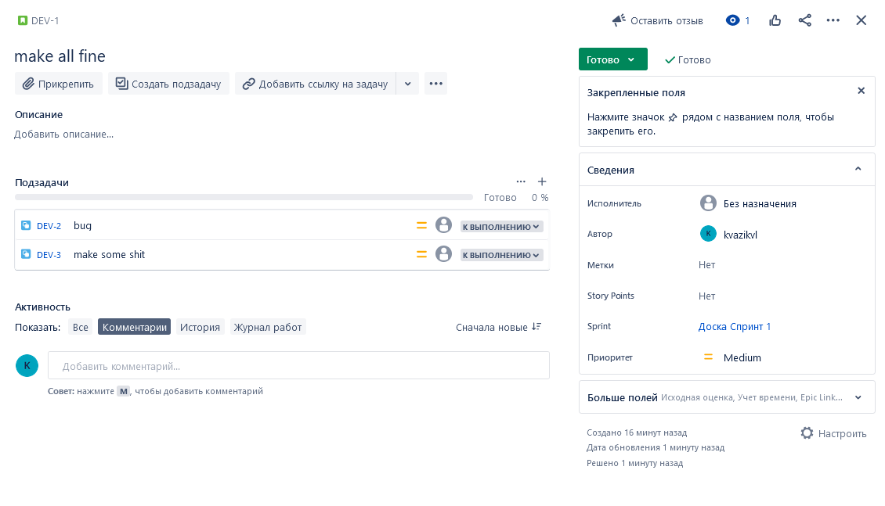
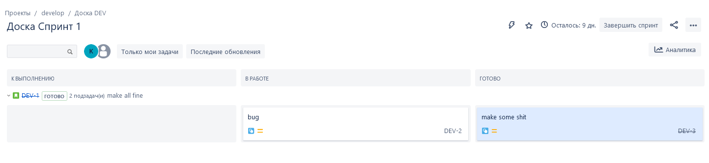

Установил VPN.
Забрел на jira, зарегистрировался.

Завел разные типы workflow для разных типов задач.

Завел задачи, прогнал по workflow туда обратно.

Завел scrum подвигал туда сюда по спринту задачи.

В принципе типовой трекер.
Конечно привычнее работать с redmine, на работе используем именно его, со кучей плагинов для scrum, kanban и тд.
Если речь про обучиться работать с трекерами, то тут никакой сложности нет, так как сам в разработке более 8 лет.

