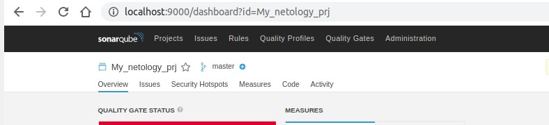
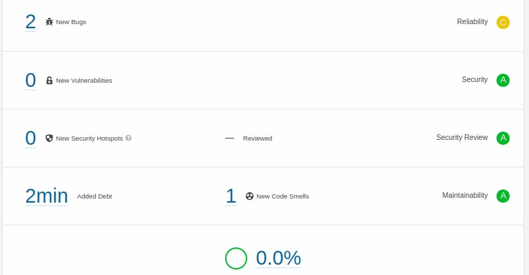
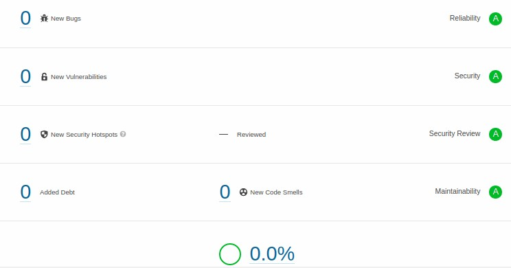
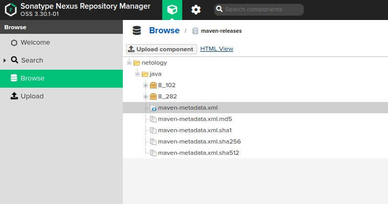
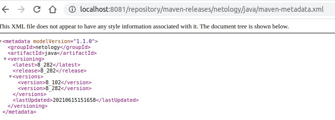

1.  Создаём новый проект, название произвольное
    Скачиваем пакет sonar-scanner, который нам предлагает скачать сам sonarqube
    Делаем так, чтобы binary был доступен через вызов в shell (или меняем переменную PATH или любой другой удобный вам способ)
    Проверяем sonar-scanner --version
    Запускаем анализатор против кода из директории example с дополнительным ключом -Dsonar.coverage.exclusions=fail.py
    Смотрим результат в интерфейсе
    Исправляем ошибки, которые он выявил(включая warnings)
    Запускаем анализатор повторно - проверяем, что QG пройдены успешно
    Делаем скриншот успешного прохождения анализа, прикладываем к решению ДЗ

Установил сонар


Анализ кода с ошибкой


Анализ кода после исправления



2. Знакомство с Nexus

Установлен nexus, создан репозиторий


Метадата



3. Знакомство с maven

    Скачиваем дистрибутив с maven
    Разархивируем, делаем так, чтобы binary был доступен через вызов в shell (или меняем переменную PATH или любой другой удобный вам способ)
    Проверяем mvn --version
    Забираем директорию mvn с pom

    Основная часть

    Меняем в pom.xml блок с зависимостями под наш артефакт из первого пункта задания для Nexus (java с версией 8_282)
    Запускаем команду mvn package в директории с pom.xml, ожидаем успешного окончания
    Проверяем директорию ~/.m2/repository/, находим наш артефакт
    В ответе присылаем исправленный файл pom.xml

```
<project xmlns="http://maven.apache.org/POM/4.0.0" xmlns:xsi="http://www.w3.org/2001/XMLSchema-instance"
  xsi:schemaLocation="http://maven.apache.org/POM/4.0.0 http://maven.apache.org/xsd/maven-4.0.0.xsd">
  <modelVersion>4.0.0</modelVersion>
 
  <groupId>com.netology.app</groupId>
  <artifactId>simple-app</artifactId>
  <version>1.0-SNAPSHOT</version>
   <repositories>
    <repository>
      <id>my-repo</id>
      <name>maven-public</name>
      <url>http://localhost:8081/repository/maven-public/</url>
    </repository>
  </repositories>
  <dependencies>
    <dependency>
      <groupId>netology</groupId>
      <artifactId>java</artifactId>
      <version>8_282</version>
      <classifier>distrib</classifier>
      <type>tar.gz</type>
    </dependency> 
  </dependencies>
</project>
```
